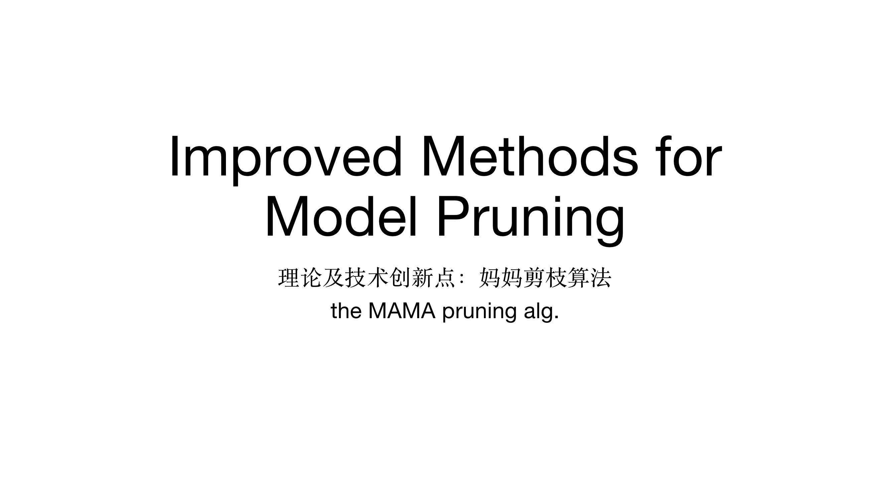
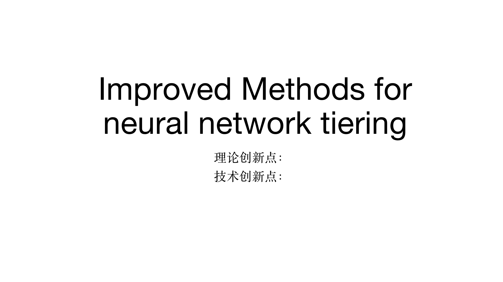
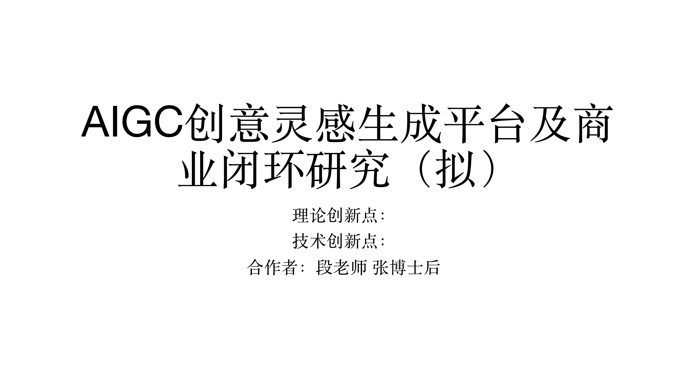
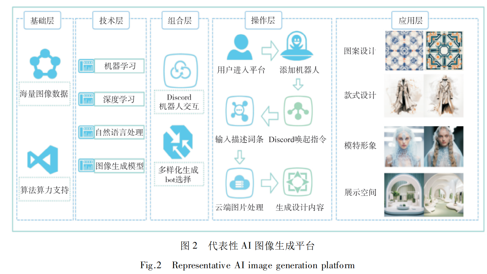

## PI：江纬 Wei Jiang
## 当前研究课题：多模态内容感知、生成及个性化创意应用场景研究
## 理论框架依托：认知计算广告 认知计算时尚
## 核心相关工作
### 1. 计算广告
（写作思路：根据计算广告逻辑演进框图进行文字表述）
计算广告是利用计算机技术对广告投放进行优化、定制和智能化，以提高广告精准投放和效果的一种广告模式【1】。它是互联网广告发展的重要形式，成为各大互联网公司的核心收入来源【2】。计算广告经历了以下3个主要发展阶段【6】。（1）1.0 时代: 程序化广告，基于简单数学模型，以文字广告为主，通过竞价排名等机制进行广告投放，代表系统如Google Ads、百度搜索广告系统等；（2）2.0 时代: 智能推荐广告，对用户画像和广告特征进行更精细的分析，在广告智能投放和效果付费方面有长足进步，如微信朋友圈、抖音、Meta Ads等的智能广告投放系统；（3）3.0 时代: 认知计算广告，以AI技术为基础，以AIGC为逻辑，以认知科学为理论，重点解决广告创意生成等问题，利用多模态垂类模型生成文字、图片、视频等创意广告内容。计算广告进入3.0认知时代后，业界尚未出现在此领域的杰出代表性公司。

### 2. 中国认知计算广告知识体系
认知计算广告的理论体系诞生于2024，由段淳林及其研究团队首先提出，在【10】中有对其理论体系发展脉络的系统性论述。其中，类思维，智能体社交及价值对齐是三个核心概念。类思维【】是指智能体通过分类、归纳等认知过程，对事物进行抽象和概括，从而达到对复杂环境的理解和预测。这种类概念思维是智能体社交的基础，帮助智能体快速感知外界，并做出相应的反应。智能体社交【】指智能体之间基于类思维进行信息交互和行为协调的过程。不同的智能体可以通过交流与协作，共享知识和经验，以实现目标，这种社交互动是智能系统发展的关键。价值对齐【】是指智能体间的目标价值趋同。当智能体内部价值系统和外部环境的价值目标达成基本一致时，就实现了价值对齐。这是智能体最终实现高度自主和协同的基础。阿诺德的认知-情感-异动模型在该知识体系中占据重要地位。他认为情感与认知相互作用，共同影响个体行为。在广告中，可依据此模型深入理解消费者的情感和认知反应，从而更精准地制定广告策略，提升广告效果。

本知识体系的外延在众多学者的共同努力下得到较好的发展。在【7】中，团队在此核心理论下进一步率先提出基于认知计算广告知识体系下的研究范式，明确*。在【8】中，团队在此核心理论下进一步提出基于认知计算广告知识体系下的生产范式，明确*。在【9】中，团队在此核心理论指导下，通过量化实验，融合深度神经网络等AIGC等核心技术，使用领域数据训练了一个前沿认知计算广告传播力预测模型，并使用领域大数据对实验可行性及模型效果进行验证。初始实验结果表明，此广告传播力预测模型能准确预测特定多模态广告内容的传播力及影响力。

### 3. 基于中国认知计算广告知识体系下的“多模态内容感知、生成及个性化创意应用研究”
在【11】中，团队基于认知计算广告知识体系，以“工作流”为核心研究概念，进一步提出了（1）分布式协同工作流（2）基于节点的编排（3）低代码等核心技术的落地应用，并以时尚行业设计师工作流为例，加以验证。
在【12】中，团队基于认知计算广告知识体系，以“知识库”为核心研究概念，进一步阐明在实际生产应用中，如何综合使用关系型、非关系型，对象及新型向量数据库以构筑垂类AIGC知识库。核心待解决问题是如何对知识进行收集、整理、加工及存储，以使得更好的搜索、推荐及数据挖掘。
在【13】中，团队基于认知计算广告知识体系，以“模型”为核心研究概念，着眼于于模型的RAG、微调及长上下文等核心算法技术，系统阐明如何高效和挖掘新知识，并与所选基模型形成互补。团队进一步阐明如何在垂类行业如时尚中去灵活有效使用不同种类大模型，以满足既定评价指标。
在【14】中，团队基于认知计算广告知识体系，以“智能体”为核心研究概念，进一步提出在不同垂直场景及细分需求下如何对智能体进行选型，精选典型案例阐明如何使用智能体去满足客户的创意应用需求。
在【15】中，团队基于 TODO:
在【16】中，团队基于 TODO:
在【17】中，团队基于 TODO:

## 参考文献
### 论文
1. 段淳林，任静等.智能广告的程序化创意及其RECM模式研究[J].新闻大学,2020(2):17-31 + 119-120
2. 段淳林，杨恒等.数据、模型与决策:计算广告的发展与流变[J].新闻大学,2018(1):128-136 + 154
3. 段淳林，宋成等.用户需求、算法推荐与场景匹配:智能广告的理论逻辑与实践思考[J].现代传播.2020,42(8):199-128
4. 段淳林，崔钰婷等.计算广告学科建设持续创新能力的影响研究——组织学习与知识共享的链式中介效应分析[J].现代传播.2024年第三期
5. 段淳林，周学琴等.虚拟主播的形象行为相似性对消费者品牌信任的影响研究——基于临场感的中介效应[J].（在这篇论文中，研究团队揭示了虚拟主播的形象和行为相似性在提升消费者品牌信任中的作用，特别是临场感在此过程中扮演的重要角色。）
6. 段淳林等.生成式AI营销中的三个核心概念.20240628
7. 段淳林，魏方等.（关于认知计算广告研究范式）.2024（在投中）
8. 段淳林，陆昊琪等.（关于认知计算广告认知计算广告知识生产范式）.2024（在投中）
9. 段淳林，蒲源等.（关于认知计算广告及使用B站数据所做的实验及模型）.2024（在投中）
10. 段淳林等.（关于认知计算广告蓝皮书）.华南理工大学.2024（初稿修正中）
11. TODO 段淳林，江纬等.AIGC创意工作流 workflow 基础原创学术成果
12. TODO 段淳林，江纬等.AIGC创意知识库 kb 基础原创学术成果
13. TODO 段淳林，江纬等.AIGC创意模型 model 基础原创学术成果
14. TODO 段淳林，江纬等.AIGC创意智能体 agent 基础原创学术成果
15. TODO 段淳林，江纬等.AIGC创意类思维 think 进阶原创学术成果
16. TODO 段淳林，江纬等.AIGC创意智能体社交 collaborate 进阶原创学术成果及论文
17. TODO 段淳林，江纬等.AIGC创意及价值对齐 alignment 进阶原创学术成果及论文 

### 教科书
1. 段淳林.计算广告学导论[M].武汉:华中科技大学出版社,2022
2. 刘鹏,王超.计算广告:互联网商业变现的市场与技术[M].3版.北京:人民邮电出版社,2022
3. 段淳林.整合品牌传播:从IMC到IBC理论建构[M].北京:人民出版社,2020
4. 陈刚等.创意传播管理:数字时代的营销革命[M].北京:机械工业出版社,2012
5. BISHOP C M. Pattern Recognition and Machine Learning. Springer[J]. IEEE Transactions on Pattern Analysis and Machine Intelligence (PAMI), 2006, 16(4):049901
6. TODO ARENSW.当代广告学[M].丁俊杰,程坪,译.北京:人民邮电出版社,2005

### 相关学术研讨会
1. 生成式AI与跨学科融合：机遇、挑战与应对.华南理工大学.20240613

## 子课题

### 子课题及论文题目（拟） - 1 - “创意工作流”在垂直领域的应用研究
#### 摘要
* 本文着重探讨 AIGC 内容创意工作流在垂直领域的应用。AIGC 工作流包含多个分步节点，各节点有明确的输入与输出。在内容创意中，从创意激发到独特内容输出及优化调整，呈现丰富流程。当前业界多为单一工作流，而本文研究分布式协同工作流问题，旨在解决不同节点间的协同难题。提出可利用先进的通信技术与智能分配机制，促进各节点高效协作。此工作流对内容创意具有深远价值，广泛应用于多模态内容感知生成及个性化创意应用场景，为推动垂直领域的内容创新提供新路径。

#### 关键词
* 工作流

#### 作者
* （相关研究团队成员如段淳林、江纬及陆昊琪等）

#### 同行评审
* 陈刚（deadline: 2024 fall）

#### 组织
* 

#### 简介
* 在当今数字化时代，AIGC（人工智能生成内容）正逐渐在各个垂直领域展现出巨大的潜力。其中，内容创意工作流的不断发展与变革为认知计算广告和认知计算时尚等领域带来了新的机遇。
* 单一工作流通常是指传统的内容创作方式，由个人或小团队独立完成从创意构思到最终成品的整个过程。例如，在广告领域，一位文案撰写人员独自负责广告文案的创作，可能经过多次修改后提交给上级审核。在时尚领域，设计师凭借个人灵感和经验进行服装设计，然后制作出样品。这种工作流的优势在于创作者对整个作品有较高的掌控度，但也存在效率低下、创意局限性大等问题。
* 分布式协同工作流则与单一工作流有着显著区别。分布式协同工作流借助 AIGC 技术，将内容创作过程分解为多个环节，并由不同的参与者在不同的地点协同完成。在认知计算广告中，AIGC 可以快速生成多个广告创意方案，然后由策划人员、设计师、营销人员等共同对这些方案进行评估和优化。在认知计算时尚领域，AIGC 可以根据时尚趋势和用户需求生成设计草图，设计师在此基础上进行进一步的创作，同时市场人员可以利用 AIGC 生成的营销内容进行推广。这种工作流能够充分发挥各参与者的专业优势，提高工作效率，同时也能激发更多的创意灵感。
##### 现存问题与挑战
* 
* linkai workflow【16】
* 现有工作流通常包含基础节点和应用，能够进行流程的运行、保存以及接入等操作。在节点设置方面，可以涉及大模型，如意图分支、知识库等，其中也可能包括搜索商品知识库以及文案润色等插件的应用。同时，也存在分支节点，这些节点往往是预先由真人专家预先编排好的，用于处理不同的情况和任务。例如在商品导购等场景中，通过搜索商品知识库、利用插件进行销售数据查询等操作，实现特定的功能。然而，现有的工作流尚存一定局限性。

* google distributed workflow【17】
* Google 的这一架构呈现出分布式的设计特点。该架构主要用于语言模型和视觉模型的训练，其中涉及 “A” 和 “B” 两个元素进行正向和反向的传递过程，采用了正向反向传播算法。同时，架构中存在调度器，能够调度不同的算法算力，可被视为分布式工作流的典型例子。然而，美中不足的是，在创意内容创作领域，这种分布式协同工作流的应用还比较少见，目前未见先例。虽然 Google 在算力方面有一定的心得，但在创意内容创作的分布式协同方面仍有很大的探索空间。
* 创新点及难点在于（1）如何设计分布式协同工作流及（2）分布式协同工作流在垂直领域的应用。

#### 相关工作
* TODO: 新增 计算广告相关文献【】【】【】【】【】
* TODO: 新增 中国认知计算广告知识体系【】【】【】【】【】
* TODO: 新增 基于认知计算广告的多模态内容感知、生成及个性化创意应用研究【】【】【】【】【】
* TODO: 重新组织技术逻辑推荐相关。随着人工智能技术的不断发展，AIGC 在内容创意领域展现出巨大潜力。ChatGPT【1】 以 Transformer【2】 为基础架构，开创了大模型语言智能对话的先河，为内容感知提供了新的思路。从 Google【3】 到 OpenAI 的发展历程，标志着语言模型的重大突破。内容感知从单一维度逐渐向多模态发展，Gemini 在此方面表现出色。它能够综合处理多种模态的信息，为用户提供更加丰富的体验。在生成方面，encoder-decoder 架构【】被广泛应用。不仅在文本生成中发挥重要作用，还在图片生成领域取得显著成果。例如，Stable Diffusion【4】 在图片生成方面具有很高的质量和效率。
* 从技术推演路径来看，2013 年 AlexNet【6】 的出现将深度学习带入人工智能领域，首先在图像领域取得突破，随后在文字处理方面也获得成功。此后，不断有新的技术突破，多模态框架的整合【7】使得不同类型的数据能够更好地融合。Transformer 架构的出现更是为语言处理带来了革新，随后  Diffusion-Transformer 架构以及像 Sora【8】 这样能够生成视频的技术不断涌现。在算力方面，随着硬件设备的不断升级，计算能力得到大幅提升，为大规模模型的训练和应用【9】提供了支持。算法的创新也不断推动着 AIGC 的发展，数据的丰富和质量的提高则为模型的训练提供了坚实的基础【10】。
* 目前业界的工作流主要有两种类型【11】，一种是以降本增效为目标的工作流【12】，另一种则是聚焦于内容创意的工作流【13】。然而，现有的工作流大多为单一工作流，在协同性和灵活性方面存在一定的局限性【14】。本文的创新点在于提出了分布式协同工作流，旨在解决传统单一工作流的问题，更好地满足垂直领域中内容创意的需求。通过节点编排和低代码等技术【15】，实现各环节的高效协同，提高内容创意的质量和效率。

#### 我们提出的理论 - 创意设计工作流新范式
1. TODO: 分布式协同
2. TODO: 聚焦创意灵感生成
3. TODO: 高度智能化
4. TODO: 人机协同【18】
5. TODO: 环保与可持续【19】
6. TODO: 智能任务调度
7. TODO: 智能计算资源分配
8. TODO: 智能节点编排
9. TODO: 低代码
10. TODO: 新增 理论图

#### 我们提出的相匹配技术
1. TODO: 技术1 待讨论
2. TODO: 技术2 待讨论
3. TODO: 技术3 待讨论
4. TODO: 新增 技术框架图

#### 实验原型系统及落地应用情况
* TODO: 待设计案例：时尚行业设计师分布式协作工作流 - 设计折扣券【20】
##### 典型案例

* GIMC design workflow
* 省广集团的灵犀案例为个性化创意应用场景研究提供了宝贵的实践经验【5】。该案例展示了如何利用 AIGC 技术实现个性化的创意内容，为企业带来了良好的经济效益和社会效益。此外，还有其他相关研究和实践也为 AIGC 内容创意工作流在垂直领域的应用提供了参考。这些工作共同推动了 AIGC 技术的发展和应用，为未来的创新提供了坚实的基础。其核心工作流程如下：
1. AI文案 TODO:
2. MJ图像 TODO:
3. 扩图+优化 TODO:
4. 大师图像 TODO:
5. 高清放大 TODO:
6. 扣除+替换 TODO:

#### 结论
* 本文深入研究了 AIGC 内容创意工作流在垂直领域的应用，创新性地提出了分布式协同工作流。该工作流基于节点编排和低代码等核心技术，充分发挥其优势，有效解决了传统单一工作流的局限性。在实际应用中，分布式协同工作流展现出了良好的落地效果。它能够提高内容创意的效率和质量，满足垂直领域多样化的需求。同时，通过各节点的协同合作，实现了多模态内容的感知生成和个性化创意的应用。未来，随着技术的不断发展，AIGC 内容创意工作流将在更多垂直领域得到广泛应用，为推动行业的创新与发展发挥更大的作用。
* 我们同时基于认知计算广告理论内核及外延，提出在垂直领域应用下的“工作流”创意设计新范式，并以时尚行业设计师工作流为例，设计原型实验并加在实际生产系统进行小范围验证。

#### 参考资料
1. 
2. 
3. 
4. 
5. 
6. 
7. 
8. 
9. 
10. 

#### 附加信息
* 写作思路：从基本工作流过渡到分布式协同工作流
* 创新点及难点：（1）如何设计分布式协同工作流及（2）分布式协同工作流在垂直领域的应用
* 候选案例1：如何使用 linkai 构建营销工作流？
* 候选案例2：省广集团是如何有效使用工作流及协同功能以降本增效？
* 候选案例3：在广告创意垂类中如何解决分布式协同问题？
* 候选案例4：智能营销洞察
  * 步骤1：对数据进行分析洞察
  * 步骤2：获得消费者反馈，丰富顾客画像
  * 步骤3：优化营销运营策略
  * 步骤1-3 不断迭代
* 候选案例5：生成式AI的多模态内容生成
  * 线性前置步骤：创意确定
    * 并行步骤: 文本
    * 并行步骤: 图片
    * 并行步骤: 声音
    * 并行步骤: 视频
    * 并行步骤: 代码
  * 线性后置步骤：人工审核
* TODO:使用数字签名是否能有效防止工作流被篡改？
* 所投期刊《新闻界》

### 子课题及论文题目（拟） - 2 - “创意知识库”在垂直领域的应用研究
#### 摘要 Abstract
* This paper begins by examining the traditional single modality knowledge base and then progresses to explore the development and significance of a multimodal knowledge base in the realm of AI-generated content (AIGC). As the field of AIGC expands, the need for a knowledge base that can handle multiple modalities such as text, image, video, and other objects becomes crucial. The research focuses on the construction, organization, and application of this multimodal knowledge base specifically within the context of AIGC, rather than in the areas of increasing productivity or streamlining workflows. By analyzing the transition from single modality to multimodal knowledge bases, this paper provides insights into the future directions of AIGC and its potential impact on various industries.
#### 关键词 Keywords
* AIGC multimodal perception generation personalization creativity application knowledgebase

#### 作者 Authors
* (related research team)

#### 同行评审
* 吴小坤（deadline: 2024 fall）

#### 组织 Organization
* South China University of Technology

#### 简介 Introduction
* 随着信息技术的快速发展，知识库在各个垂直领域的应用日益广泛。然而，传统的知识库大多是以单一模态为主，主要依赖文本、图表等结构化或半结构化数据的形式来存储和管理知识。随着现代需求的不断变化和信息量的爆炸式增长，传统的单一模态知识库逐渐暴露出其局限性，无法全面、高效地支持复杂的创意需求。在垂直领域中，诸如广告、医疗、教育等行业对创意的要求不断提高，而这些领域不仅需要传统的文字、数据等信息，还需要利用图像、声音、视频等多模态数据来丰富知识库的表现力。因此，多模态知识库应运而生，成为解决这一问题的重要途径。
* 单一模态知识库：单一模态知识库最早期的形态是以文本为主要存储和组织方式的知识管理系统。在这种体系中，知识以纯文本、结构化数据或简单图表的形式呈现，系统通过关键字检索和规则匹配来进行信息的管理与获取。由于其形式简单、开发相对容易，单一模态知识库被广泛应用于早期的行业知识管理，如法律、学术研究、技术文档等领域。然而，随着数据的复杂性增加，特别是随着互联网和移动设备的普及，知识获取的多样化需求日益增加，单一模态知识库的不足也逐渐显现出来。其局限性体现在以下几个方面：（1）信息表达的局限性：单一模态知识库往往只能处理文字、数据等少数形式的信息，对于包含图像、视频、声音等丰富信息的多媒体资源支持不足。（2）检索效率低下：传统的文本检索方式难以处理多维度的信息需求，用户在需要获取复杂内容时往往需要依赖手动筛选，降低了信息获取的效率。（3）创意支持不足：特别是在广告、设计等对创意要求较高的行业，单一模态的文字和数据无法充分支持创意工作者的需求，限制了创意的多元表达与激发。
* 多模态知识库：为了解决这些问题，多模态知识库逐渐被提出和发展。多模态知识库结合了文本、图像、音频、视频等多种信息模态，通过智能化技术（如自然语言处理、计算机视觉、深度学习等）将不同类型的数据统一整合并组织起来，从而为用户提供更加丰富、全面的信息资源。在多模态知识库中，各种模态的信息相互补充。例如，在广告创意领域，文案和视觉素材的结合至关重要，多模态知识库不仅可以存储广告文案，还能提供对应的图片、音频甚至视频建议。这种综合性的信息组织方式极大提升了创意生产的效率和质量。多模态知识库的核心优势包括：（1）丰富的信息表达：多模态知识库不仅能处理文字，还能整合图像、视频、音频等多种形式的信息，使得知识的存储和检索更加多样化。（2）提高检索精准度：借助人工智能和深度学习技术，用户可以通过文字描述找到图像，或通过图像搜索相似的多模态资源，极大提高了信息检索的效率和准确性。（3）增强创意支持：通过多模态数据的结合，创意工作者可以获得更多灵感来源，从而推动创意的进一步发展。
* 现存问题与挑战：尽管多模态知识库带来了诸多优势和创新，然而在应用过程中也面临着一系列的问题和挑战：（1）数据整合难度大：多模态数据的异质性使得不同模态的数据之间难以进行有效的整合和关联。不同模态的处理方式和存储格式各不相同，导致数据间的交互和转换成为技术上的难点。（2）计算资源要求高：处理多模态数据需要大量的计算资源，尤其是在涉及图像和视频的分析时，系统的计算和存储负担显著增加。这对系统的可扩展性和成本控制提出了更高的要求。（3）跨模态理解不完善：尽管目前有许多针对多模态数据处理的技术，但在不同模态之间进行深度关联和语义理解仍然是一大挑战。如何让系统真正理解文字与图像、视频等信息之间的关联，依然需要更多的技术突破。（4）数据隐私和安全问题：多模态知识库中可能涉及大量的个人隐私信息，特别是在医疗、广告等领域，如何确保数据的隐私和安全，是其在实际应用中的重要挑战。
* 论文后续章节我们排列如下：我们在简介部分提出了问题与挑战，在第二部分论述相关工作，在第三部分论述理论构建，在第四部分论述技术推演，在第五部分论述典型落地案例及实验原型（跨学科优势），我们在第六部分进行总结。
* 本论文的贡献主要体现在理论及技术创新点上。理论创新点在于构建了一个结合多模态信息的知识库理论框架，特别针对创意驱动型行业的特殊需求进行优化。技术创新点则体现在（1）多模态（2）快速存储（3）快速信息挖掘等方面的技术创新与突破。这些理论及技术创新不仅有助于提升创意工作的效率，还能够为知识库的未来发展提供新的技术方向。

#### 相关工作 Related Work
* The history of databases traces back to the efforts of IBM researchers who first developed relational databases[1]. These databases consist of tables with primary keys and reference keys, and support operations like join, select, and where in SQL query languages. With the growth of giant applications like web search[2] & recommendation[3], the need to handle unstructured text became more prominent in recent decades. This led to the emergence of non-relational databases like MongoDB[4] and others. These databases allow for storing strings of variable lengths, providing a certain degree of flexibility. In most of the distributed system architectures[5], Redis[6] is usually servered as a caching database. Being an in-memory database, it offers fast retrieval speed but has the known limitations such as cache miss. If a cache miss occurs, a query to the backend database is sometimes required, which can be time-consuming though more precise. The era of web search engines[7] brought about the use of data structures like inverted indexes[8], which support faster retrieval and better quality for web searches[9]. New developments in databases include vector databases[10] that find important applications[11] in large language models and other related retrieval techniques[12]. The focus of this paper is on how to orchestrate[13] those databases and provide a unified interface[14] for upper-level applications[15]. 

#### 我们提出的理论（理论构建）
* 

#### 我们提出技术支撑（即技术逻辑及推演）
* 

#### 实验原型系统及落地应用情况（实际应用）
* 

#### 结论 Conclusion
* 

#### 参考资料 References
1. RMDBs
2. Google Search
3. Amazon Recommendations
4. MongoDB and other NoSQL databases
5. Distributed systems such as Hadoop and Spark
6. Redis
7. New York Times reporting on web search
8. Inverted indexes tutorial from University of Melbourne
9. Web search engines like Google, Bing, and Yahoo
10. Vector databases such as TODO:
11. RAG (short for retrieval augmented generation)
12. consin similarity and bm25 ranking algorithms
13. Orchestration of databases

#### 附加信息
* paper 2 - kb.md
* 关键词及着眼点：知识库
* 写作思路：从基本单一知识库到多模态AIGC创意知识库
* 基于认知计算广告理论，进一步系统阐明在实际生产应用中，如何综合使用关系型、非关系型，对象及新型向量数据库以构筑垂类AIGC知识库供下游应用调用。
* 创新点1：多模态AIGC创意知识库
* 创新点2：AIGC创意知识库是如何把 (1) 元认知知识 (2) 概念性知识 (3) 程序性知识及 (4)技能性知识整理、归纳并融合在一起的
* 创新点3：多模态知识库半自动生成法的重要作用（保证入库数据质量）
* 案例1：如何使用dify平台构建多模态AIGC创意知识库
* 案例2：如何使用coze平台构建多模态AIGC创意知识库
* 所投期刊：新闻与传播如 TODO: 未确定

### 子课题及论文题目（拟） - 3 - “创意垂类模型"在垂直领域的应用研究
#### 摘要 Abstract
* This paper examines the realm of created models, which have the ability to generate text, images, and videos in parallel. While these models hold great promise, they also come with limitations. One significant limitation is their limited capability in expressing creativity. However, this constraint can potentially trigger inner model training and iteration. The research delves into the architecture, functionality, and applications of these created models, analyzing both their advantages and drawbacks. It explores ways to overcome the limitations and enhance the creative expression capabilities of these models. By understanding the challenges and opportunities associated with created models, this paper aims to contribute to the development and improvement of content generation and creative expression in a multi-modal world.

#### 关键词 Keywords
* 

#### 作者 Authors
* 

#### 同行评审
* 段淳林（deadline: 2024 fall）

#### 组织 Organization
* South China University of Technology

#### 简介 Introduction
* 

#### 相关工作 Related Work
* Ten years ago, language models took their first steps with Google's n-gram paper[1]. This approach employed a vast amount of web data to model language, considering n-grams like two-gram or three-gram. Following this, the word2vec paper[2] came into the picture. It modeled the world as a higher-dimensional vector space, where entities with similarity would exhibit a close cosine similarity score. This marked the beginning of a long journey in the field of language models[3]. The language model then entered a new era with the Transformer paper titled "Attention is All You Need"[4]. Google researchers proposed an encoder-decoder architecture or later variants for encoding and decoding text. This model demonstrated the remarkable ability to generate surprisingly coherent conversations, laying the foundation for subsequent works such as ChatGPT[5] in 2022. ChatGPT's emergence surprised and captivated the world at scale. In addition to these, leading industry models like Google's Gemini have been developed. In China, works like Doubao[6] also deserve mention. Doubao showcases advanced Chinese language processing capabilities and has made significant contributions to the field.
* In addition to the advancements in language models, there have been remarkable developments in other generation created models. For instance, Stable Diffusion[7] has made significant contributions in the field of image generation. It employs innovative techniques to create high-quality images with great detail and realism. Another notable model is Flux[8] by the Black Forest Lab, which also excels in generating images. Moreover, in the realm of video generation, models utilizing improved architectures like diffusion-transformer(short for DiT) have emerged. These models have the potential to revolutionize the way videos are created, offering new possibilities for creative expression and content production. By combining the power of transformers and diffusion processes, they can generate videos with enhanced visual quality and coherence[9]. These developments in image and video generation models complement the progress in language models, opening up new frontiers in the field of created models and expanding the boundaries of what can be achieved in content generation.
* Another interesting aspect of created models is the emergence of those that focus on generating music snippets or music demos[10]. These models have the potential to inspire musicians and composers, providing new musical ideas and elements. They can contribute to the creation of unique and engaging musical compositions. In addition, there are created models that generate code[11]. These models can produce code snippets or even complete programs that can be executed in environments like Python. This has significant implications for software development, as it can assist developers in generating code effectively and efficiently, leading to faster development cycles and much more.

#### 现有典型垂类模型及所存问题 Current Creative Models and Problems
* 

#### 所提出关于“垂类模型”的创意设计新范式 New Design Paradigm for Creative Models
* 

#### 实验原型系统及应用场景 Real-world Applications and Prototypes
* 

#### 结论 Conclusion
* Created models have made remarkable progress in various domains, including text generation, image and video production, code generation, and music creation. Each of these areas has seen the emergence of powerful models that offer unique capabilities and opportunities for creative expression. TODO: However, as these models focus on different domains, there is a need for a unified interface and application to use them coherently and efficiently.

#### 参考资料 References
1. n-gram
2. word2vec
3. classic textbook in the field of natural language processing
4. Attention is All You Need
5. ChatGPT official website
6. Doubao official website
7. Stable Diffusion official website
8. Flux official website
9. Sora official website
10. Suno official website
11. Gemini Code Assist official website

#### 附加信息
* paper 3 - model.md
* 关键词及着眼点：垂类模型
* 写作思路：使用RAG技术使生文通用模型足够垂类，使用微调技术使生图通用模型足够垂类。
* 基于认知计算广告理论，着眼于于垂类大模型RAG（生文模型）、微调（生图、生视频模型）等技术，系统阐明如何高效挖掘新知识，使通用知识大模型插上垂类翅膀，并提及提示词工程及智能词元（token）生成，即大模型是通过什么架构去处理多模态的输入及输出的。
* 创新点1：多模态混合专家模型 multi-modal mixed of expert model. The arch contains the broker model and a set of worker models such as text-to-image model, text-to-video and text-to-music model etc.
* 创新点2：on the side of the broker model, add long context & memory support for it.
* 创新点3：on the side of the worker models, add the ability to learn from the broker model's feedback.
* 创新点4：TODO: maybe ADD support for edge & cloud model as well?
* 案例1：如何使用“通用生文大模型 + RAG“做带有风格的时尚内容创作（文本）
* 案例2：如何使用“通用生图大模型 + 微调”做带有风格的时尚内容创作（图片）
* 案例3：如何使用“通用生视频大模型 + 微调”做带有风格的时尚内容创作（视频）
* 所投期刊：新闻与传播如 TODO: 未确定

### 子课题及论文题目（拟） - 4 - “创意智能体”在垂类场景中的应用研究

#### Abstract
* This paper begins by clarifying the concept that an intelligent agent is distinct from large language models or large vision models. An intelligent agent can be metaphorically described as having a "brain" and "body" and it is designed to perform specific tasks. The control of an intelligent agent often relies on large language models or large visual models. The paper then presents different types of intelligent agents, including those for cost reduction and efficiency improvement and those for content creation. The focus of this paper is on content creation. An in-depth exploration of these content creation intelligent agents are provided, while specific case studies are yet to be determined.
#### 摘要
* 

#### 状态
* 构思中
* 社会科学论文

#### 关键词 Keywords
* AI Agent; LLM; Large Vison Model; workflow; creative models; scene;

#### 作者 Authors
* 

#### 同行评审
* 全宇晖（deadline: 2024 fall）

#### 组织 Organization
* South China University of Technology
* 华南理工大学

#### 理论构建
* 创新点：
* 创意智能体人物设定：计算机科学教授帮助学生优化算法
* 智能体间社交：真人及类人在一起协作和交流

#### 技术路径（含实验原型系统及应用场景）
* 

#### 相关工作 Related Work
##### history
* The history of AI agents traces back to early works that laid the foundation for this field. One of the most important papers is "A Logical Calculus of the Ideas Immanent in Nervous Activity" by Warren McCulloch and Walter Pitts[1], published in the 1940s. This paper introduced the concept of neural networks and their potential for computing, inspiring subsequent research in AI. In the 1950s, Alan Turing's "Computing Machinery and Intelligence"[2] proposed the Turing test, a milestone in evaluating machine intelligence. This work set the stage for the development of intelligent agents that could interact with humans. Moving forward, "Deep Reinforcement Learning from Human Preferences" by Jan Leike et al.[3] in recent years has made a significant impact. It demonstrated how agents can learn from human preferences and adapt their behavior in complex environments, advancing the capabilities of AI agents in decision-making.
##### AI Agent: code generation & exection
* One paper that focuses on agents that can not only output text but also execute code is "Program Synthesis with Large Language Models" by Mark Chen et al[4]. This paper explores the use of large language models for program synthesis, where the agent can generate code based on natural language descriptions. It shows how language models can be trained to understand programming tasks and generate executable code, blurring the line between text generation and code execution. Another relevant paper could be "Code Generation with Transformer Models" by Yuxin Wang et al[5]. This paper investigates the use of transformer models for code generation, enabling agents to produce code snippets or complete programs. It highlights the potential of combining natural language understanding and code generation capabilities in intelligent agents.
##### AI Agent: RL learning & interaction with the env
* Another aspect of related work focuses on agents that not only have a large language model as a "brain" but also possess a "body." These agents are designed to exhibit dynamic movement and motivation, and have the capability to interact with the outside world. In the realm of reinforcement learning, papers such as "Deep Reinforcement Learning for Robotic Manipulation" by Sergey Levine et al.[6] explore how agents can learn complex motor skills and interact with the physical environment through reinforcement learning. This work shows how agents can be trained to perform tasks such as grasping objects and navigating in three-dimensional spaces. Another relevant paper could be "Reinforcement Learning for Interactive Agents" by Peter Stone et al[7]. This paper examines the use of reinforcement learning for agents that interact with humans or other agents in dynamic environments. It highlights the challenges and opportunities of designing agents that can adapt and respond to changes in the environment and the actions of others.
##### AI Agent: the creative way
* In the domain of AI agents for creativity, there are several notable papers. For example, "Generative Adversarial Networks for Artistic Creation" by Ian Goodfellow et al. showcases how generative adversarial networks (GANs) can be used to generate artistic works[8]. These agents have demonstrated some degree of imagination in creating images that can be shared and appreciated. Another paper could be "Creativity in Neural Network Art Generation" by [Author's Name] [9]. This work explores the creative capabilities of neural networks in generating art and highlights the potential for such agents to push the boundaries of artistic expression. While these papers show great promise in the area of AI-driven creativity, it is important to note that there is still much work to be done. There are challenges in ensuring that the generated art is truly original and not simply mimicking existing styles[10]. Additionally, there is a need to further explore how these agents can collaborate with human artists and enhance the creative process rather than replace it[11].

#### 现有典型智能体及所存问题 Current Intelligent Agents and Problems
* 

#### 规范与治理
* 

#### 结论 Conclusion
* 

#### 参考资料 References
1. foundation work
2. turing test
3. RL concept
4. code generation protype
5. transformer based model
6. robotic manipulation
7. interaction in dynamic env
8. GAN for artistic creation
9. Creativity in art work generation
10. original art work or not
11. agent collaboration

#### 附加信息
* paper 4 - scene.md
* 关键词及着眼点：“创意型智能体”、“垂直落地场景”
* 写作思路：在开篇给出智能体的定义及行动流程，即环境交互 -> 感知信息 -> 思考 -> 采取行动。由客户需求倒推如何设计落地场景及相关智能体，并且在设计与实现智能体过程中要非常重视智能体的价值对齐问题，写作过程中需强调人机协作，强调目前智能体能达到一定的智能推理能力，但尚不够。
* 基于认知计算广告理论
* 进一步提出在不同垂直场景及细分需求下的技术选型，以满足客户需求。
* 创新点1：不强调 使用智能体以降本增效，强调 使用智能体以提升内容创作及灵感获取能力
* 创新点2：强调 提示词工程、知识库、分数的“融合微调”核心技术（案例：如何在实际工程中价值对齐一个时尚买手智能体的音容相貌乃至部分时尚大脑职能）
* 难点：多智能体如何协作与感知？如何有效从个体智能到群体智能？
* TODO: 案例1：如何设计一个智能体，她的目标是提升广告投放效果？
* TODO: 案例2：如何设计一个智能体，她的目标是输出源源不断的创意及灵感？
* TODO: 案例3：如何设计一个时尚买手智能体，她的目标是对人群或个体时尚进行评价，评分并作搭配推荐
* TODO: 案例4：华为HAS 2024 AIGC 宣传视频
* TODO: 案例5：新增 playground.com 为设计师而设计，自由设计任何东西
* TODO: 案例6：新增 civiti.com 开源生成式人工智能之家
* TODO: 实验设计：如何设计一个智能体，做落地应用场景相匹配决策（决策如智能排期）。如此广告在此刻是否生成，此广告是否投放在某个用户的折扣圈中？
* 论文中不会出现1：把智能体上升到具身智能，并且引出机器人。原因：目前业界机器人主要用于降本增效，和内容创意关系不大。
* 所投会议：计算机科学如 SIGIR, CIKM et. al.

### 子课题及论文题目（拟） - 5 - “创意类思维”在垂类场景中的应用研究

### 子课题及论文题目（拟） - 6 - “创意智能体社交”在垂类场景中的应用研究

### 子课题及论文题目（拟） - 7 - “创意价值对齐”在垂类场景中的应用研究

### 子课题及论文题目（拟） - 8 - Improved Methods for Model Pruning 改进的模型剪枝方法

#### Abstract
Model pruning is presented as a performance optimization technique for large language and vision models. This technique aims to identify and remove neurons, connections unlikely to lead to the contribution during the machine generation phase. Our goal is to obtain a much smaller and faster foundational model that can quickly generate AIGC content almost as good as those of the unpruned models. Through careful analysis of the weights, bias, activations and other potential indicators, an improved algorithm based on new indicators have been proposed and evaluated. Emprical results show that our proposed algorithm achieves significant improvement in different pruning ranges over previous STOAs.
#### 摘要
模型剪枝是一种用于大语言和视觉模型的性能优化技术。该技术旨在识别并移除在机器生成阶段不太可能产生贡献的神经元和连接。我们的目标是获得一个更小、更快速的基础模型，能够以接近未剪枝模型的水平快速生成AIGC内容，这些内容包括文本、图片、视频及代码。通过对权重、偏置、激活函数和其他潜在指标的深入分析，我们提出并评估了一种基于新指标的改进算法。实验结果表明，在不同剪枝范围内，我们提出的算法相比之前的最新技术(SOTA)取得显著改进效果。
#### 状态
* Under Review and will submit to ICLR 2025 main conference
* 自然科学论文

### 子课题及论文题目（拟） - 9 - Improved Methods for Model Tiering

* TODO: 结合MoE

### 子课题及论文题目（拟） - 10 - AIGC创意灵感生成平台及商业闭环研究（拟）

* TODO: 在上图“代表性AI生成平台”基础上提供C端用户半自主参与下的AIGC服装设计机理图。同时结合机理图提供对于用户半自主参与下的AIGC服装设计过程的英文描述及参考文献。时间节点为：10月8日。联系人：张博士后
* 状态：作为社会科学论文提交

### 子课题及论文题目（拟） - 11 - AI Agents will significantly hurt the job market for programmers！(meaning losing jobs and being replaced quickly)
* 更新日期：20240922
* 中文标题：AI智能体会极大伤害程序员就业市场！（他们会没有工作且被迅速替代）
* 状态：作为社会科学研究论文提交

### 子课题及论文题目（拟） - 12 - Attention is All You Need, again!
* 更新日期：20240923
* 中文标题：注意力机制在AIGC在认知计算广告内容创意中的应用场景研究（需结合经典传播学注意力等理论）
* 状态：作为社会科学研究论文提交

## 核心相关工作
### 1. 计算广告
（写作思路：根据计算广告历史及技术演进表意）
计算广告是利用计算机技术对广告投放进行优化、定制和智能化,以提高广告的精准投放和效果的一种广告模式【1】。它是互联网广告发展的重要形式,成为各大互联网公司的核心收入来源【2】。计算广告经历了以下3个主要发展阶段【6】。（1）1.0 时代: 程序化广告,基于简单数学模型,以文字广告为主,通过竞价排名等机制进行广告投放,如Google Ads、百度广告等基于搜索业务的投放平台；（2）2.0 时代: 智能推荐广告,对用户画像和广告特征进行更精细的分析,在广告智能投放和效果付费方面有长足进步,如Meta Ads、微信朋友圈、抖音等基于社交的智能广告投放平台；（3）3.0 时代: 认知计算广告,以AI技术为基础,以AIGC为逻辑,以认知科学为理论,重点解决广告创意生成等问题,利用多模态垂类模型生成文字、图片、视频等广告内容。而以AIGC内容创作作为核心的相关行业领导者在业界则尚未出现。市场预估在垂类领域如认知计算时尚、认知计算广告等垂直领域将会出现市值万亿的独角兽高科技公司。

### 2. 认知计算广告知识体系
TODO: 补充 阿诺德 认知-情感-意动 模型
#### 大中华地区
认知计算广告的理论体系诞生于2024，由段淳林及其研究团队首先提出，在【10】中有对其理论体系发展脉络的系统性论述。其中，类思维，智能体社交及价值对齐是三个核心营销概念。类思维【】是指智能体通过分类、归纳等认知过程,对事物进行抽象和概括,从而达到对复杂环境的理解和预测。这种类概念思维是智能体社交的基础,帮助智能体快速感知外界,并做出相应的反应。智能体社交【】指智能体之间基于类思维进行信息交互和行为协调的过程。不同的智能体可以通过交流与协作,共享知识和经验,实现目标的达成。这种社交互动是智能系统发展的关键。价值对齐【】是指智能体内部price和reward等价值系统,以及智能体之间的目标价值趋同。当智能体内部价值系统和外部环境的价值目标达成一致时,就实现了价值对齐。这是智能体最终实现高度自主和协同的基础。

理论外延在众多学者的共同努力下得到较好扩展。在【7】中，段淳林及魏方等在此核心理论下进一步率先提出基于认知计算广告的研究范式。在【8】中，段淳林及陆昊琪等在此核心理论下进一步率先提出基于认知计算广告的生产范式。在【9】中，段淳林及蒲源等在此核心理论下通过量化实验方法，融合深度神经网络等AIGC技术，使用领域数据训练了一个广告传播力预测模型，并使用B站大数据进行了可行性分析及原型验证。实验表明，此广告传播力预测模型能准确预测B站上某条广告或视频的传播力和影响力。
#### 其他地区
TODO: 待补充

### 3. 基于认知计算广告的多模态内容感知、生成及个性化创意应用研究
如【11】中，段淳林及江纬等基于认知计算广告理论，进一步提出了分布式协同工作流、基于节点的编排、低代码等核心技术的落地应用，并以时尚行业设计师工作流为例，加以验证。在【12】中，段淳林及江纬等基于认知计算广告理论，进一步系统阐明在实际生产应用中，如何综合使用关系型、非关系型，对象及新型向量数据库以构筑垂类AIGC知识库。核心待解决问题是如何对知识进行收集、整理、加工及存储，以使得更好的搜索、推荐及数据挖掘。在【13】中，段淳林及江纬等基于认知计算广告理论，着眼于于垂类大模型的RAG、微调等算法技术，系统阐明如何高效和挖掘新知识，并与所选基模型形成互补。作者进一步阐明了如何在垂类行业如时尚中去灵活使用不同的大模型、RAG及微调等方法，以满足既定评价指标。在【14】中，段淳林及江纬等基于认知计算广告理论，进一步提出在不同垂直场景及细分需求下的技术选型，以满足客户需求。

## 参考文献
### 论文
1. 段淳林,任静等.智能广告的程序化创意及其RECM模式研究[J].新闻大学,2020(2):17-31 + 119-120【已见刊 领域：计算广告】
2. 段淳林,杨恒等.数据、模型与决策:计算广告的发展与流变[J].新闻大学,2018(1):128-136 + 154【已见刊 领域：计算广告】
3. 段淳林,宋成等.用户需求、算法推荐与场景匹配:智能广告的理论逻辑与实践思考[J].现代传播.2020,42(8):199-128【已见刊 领域：计算广告】
4. 段淳林,崔钰婷等.计算广告学科建设持续创新能力的影响研究——组织学习与知识共享的链式中介效应分析[J].现代传播.2024年第三期【已见刊 领域：计算广告】
5. 段淳林,周学琴等.虚拟主播的形象行为相似性对消费者品牌信任的影响研究——基于临场感的中介效应[J].【已见刊 领域：计算广告】
6. 段淳林,魏方等.（关于认知计算广告研究范式）.2024【在投中 领域：认知计算广告】
7. 段淳林.AI智能体与知识库生成：计算广告知识生产的演进逻辑.2024【在投中 领域：认知计算广告】
8. 段淳林,蒲源等.（关于认知计算广告及使用B站数据所做的实验及模型）.2024【在投中 领域：认知计算广告】
9.  段淳林等.（关于认知计算广告蓝皮书）.华南理工大学.2024【撰写中 领域：认知计算广告】
10. TODO: 段淳林,江纬等.AIGC创意工作流.workflow【撰写中 领域：认知计算广告】
11. TODO: 段淳林,江纬等.AIGC创意知识库.kb【撰写中 领域：认知计算广告】
12. TODO: 段淳林,江纬等.AIGC创意模型.model【撰写中 领域：认知计算广告】
13. TODO: 段淳林,江纬等.AIGC创意智能体.agent【撰写中 领域：认知计算广告】
14. TODO: 段淳林,江纬等.AIGC创意类思维.think【撰写中 领域：认知计算广告】
15. TODO: 段淳林,江纬等.AIGC创意智能体社交.communicate【撰写中 领域：认知计算广告】
16. TODO: 段淳林,江纬等.AIGC创意价值对齐.alignment【撰写中 领域：认知计算广告】

### 教科书
1. 段淳林.计算广告学导论[M].武汉:华中科技大学出版社,2022
2. 刘鹏,王超.计算广告:互联网商业变现的市场与技术[M].第3版.北京:人民邮电出版社,2022
3. 段淳林.整合品牌传播:从IMC到IBC理论建构[M].北京:人民出版社,2020
4. 陈刚等.创意传播管理:数字时代的营销革命[M].北京:机械工业出版社,2012
5. BISHOP C M. Pattern Recognition and Machine Learning. Springer[J]. IEEE Transactions on Pattern Analysis and Machine Intelligence (PAMI), 2006, 16(4):049901
6. TODO: ARENSW.当代广告学[M].丁俊杰,程坪,译.北京:人民邮电出版社,2005

### 相关学术研讨会
1. 生成式AI与跨学科融合：机遇、挑战与应对.华南理工大学.20240613

### Cool Research Problems
1. given a pre-trained dense LLMs, how to obtain a effective sparse LLM? For example, the sparsification of linear layers.
2. given a pre-trained dense NOT LLMs but Large Vision Models, how to prune?
3. 
