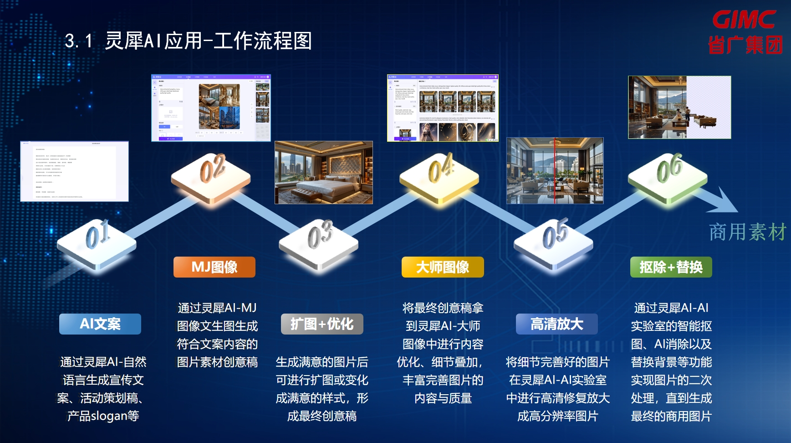
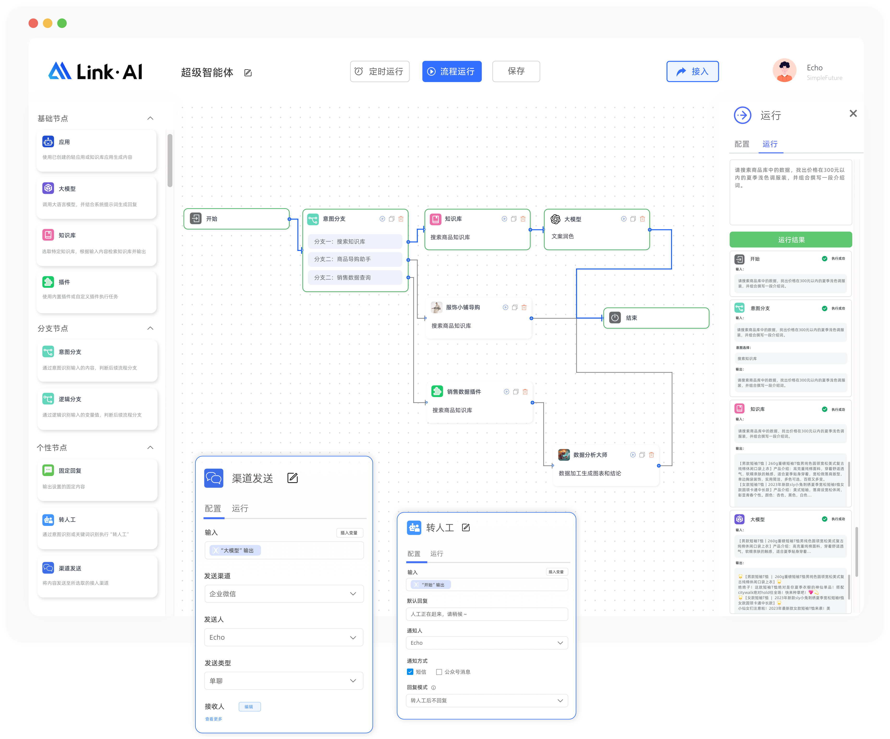
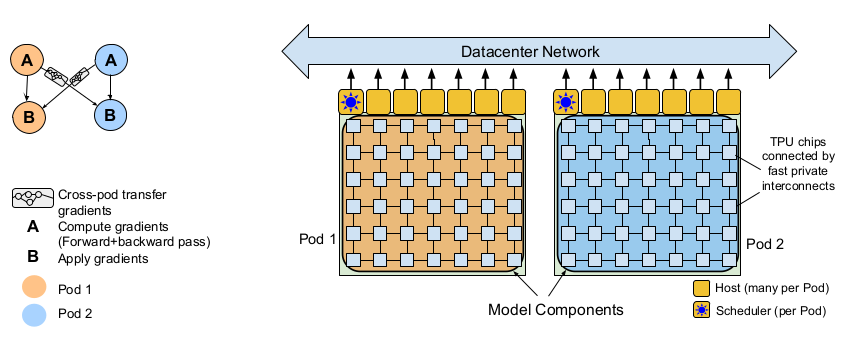

## 当前研究课题：多模态内容感知、生成及个性化创意应用场景研究
## 当前理论框架依据：认知计算广告
## 子课题
### 子课题及论文题目（拟） - 1 - “AIGC内容创意工作流”在垂直领域的应用
#### 摘要
* 本文着重探讨 AIGC 内容创意工作流在垂直领域的应用。AIGC 工作流包含多个分步节点，各节点有明确的输入与输出。在内容创意中，从创意激发到独特内容输出及优化调整，呈现丰富流程。当前业界多为单一工作流，而本文研究分布式协同工作流问题，旨在解决不同节点间的协同难题。提出可利用先进的通信技术与智能分配机制，促进各节点高效协作。此工作流对内容创意具有深远价值，广泛应用于多模态内容感知生成及个性化创意应用场景，为推动垂直领域的内容创新提供新路径。

#### 关键词
* AIGC 多模态内容 感知 生成 个性化创意应用 算法 场景 工作流

#### 作者
* （相关研究团队）

#### 组织
* 华南理工大学

#### 简介
* 

#### 相关工作
* TODO: 新增 认知计算广告理论【21】【22】【23】【24】【25】
* 随着人工智能技术的不断发展，AIGC 在内容创意领域展现出巨大潜力。ChatGPT【1】 以 Transformer【2】 为基础架构，开创了大模型语言智能对话的先河，为内容感知提供了新的思路。从 Google【3】 到 OpenAI 的发展历程，标志着语言模型的重大突破。内容感知从单一维度逐渐向多模态发展，Gemini 在此方面表现出色。它能够综合处理多种模态的信息，为用户提供更加丰富的体验。在生成方面，encoder-decoder 架构【】被广泛应用。不仅在文本生成中发挥重要作用，还在图片生成领域取得显著成果。例如，Stable Diffusion【4】 在图片生成方面具有很高的质量和效率。

* GIMC design workflow
* 省广集团的灵犀案例为个性化创意应用场景研究提供了宝贵的实践经验【5】。该案例展示了如何利用 AIGC 技术实现个性化的创意内容，为企业带来了良好的经济效益和社会效益。此外，还有其他相关研究和实践也为 AIGC 内容创意工作流在垂直领域的应用提供了参考。这些工作共同推动了 AIGC 技术的发展和应用，为未来的创新提供了坚实的基础。其核心工作流程如下：
1. AI文案 TODO:
2. MJ图像 TODO:
3. 扩图+优化 TODO:
4. 大师图像 TODO:
5. 高清放大 TODO:
6. 扣除+替换 TODO:
* 从技术推演路径来看，2013 年 AlexNet【6】 的出现将深度学习带入人工智能领域，首先在图像领域取得突破，随后在文字处理方面也获得成功。此后，不断有新的技术突破，多模态框架的整合【7】使得不同类型的数据能够更好地融合。Transformer 架构的出现更是为语言处理带来了革新，随后  Diffusion-Transformer 架构以及像 Sora【8】 这样能够生成视频的技术不断涌现。在算力方面，随着硬件设备的不断升级，计算能力得到大幅提升，为大规模模型的训练和应用【9】提供了支持。算法的创新也不断推动着 AIGC 的发展，数据的丰富和质量的提高则为模型的训练提供了坚实的基础【10】。
* 目前业界的工作流主要有两种类型【11】，一种是以降本增效为目标的工作流【12】，另一种则是聚焦于内容创意的工作流【13】。然而，现有的工作流大多为单一工作流，在协同性和灵活性方面存在一定的局限性【14】。本文的创新点在于提出了分布式协同工作流，旨在解决传统单一工作流的问题，更好地满足垂直领域中内容创意的需求。通过节点编排和低代码等技术【15】，实现各环节的高效协同，提高内容创意的质量和效率。

#### 现有典型工作流及所存问题

* linkai workflow【16】
* 现有工作流通常包含基础节点和应用，能够进行流程的运行、保存以及接入等操作。在节点设置方面，可以涉及大模型，如意图分支、知识库等，其中也可能包括搜索商品知识库以及文案润色等插件的应用。同时，也存在分支节点，这些节点往往是预先由真人专家预先编排好的，用于处理不同的情况和任务。例如在商品导购等场景中，通过搜索商品知识库、利用插件进行销售数据查询等操作，实现特定的功能。然而，现有的工作流尚存一定局限性。

* google distributed workflow【17】
* Google 的这一架构呈现出分布式的设计特点。该架构主要用于语言模型和视觉模型的训练，其中涉及 “A” 和 “B” 两个元素进行正向和反向的传递过程，采用了正向反向传播算法。同时，架构中存在调度器，能够调度不同的算法算力，可被视为分布式工作流的典型例子。然而，美中不足的是，在创意内容创作领域，这种分布式协同工作流的应用还比较少见，目前未见先例。虽然 Google 在算力方面有一定的心得，但在创意内容创作的分布式协同方面仍有很大的探索空间。
* 创新点及难点在于（1）如何设计分布式协同工作流及（2）分布式协同工作流在垂直领域的应用。

#### 所提出关于“工作流”的创意设计新范式
* TODO: 清楚定义什么叫分布式协同工作流
* TODO: 聚焦于创意灵感
* TODO: 高度智能化
* TODO: 人机协同【18】
* TODO: 环保与可持续【19】
* TODO: 智能任务调度
* TODO: 智能计算资源分配
* 智能节点编排
* 低代码

#### 实验原型系统及应用场景
* TODO: 待设计案例：时尚行业设计师分布式协作工作流 - 设计折扣券【20】

#### 结论
* 本文深入研究了 AIGC 内容创意工作流在垂直领域的应用，创新性地提出了分布式协同工作流。该工作流基于节点编排和低代码等核心技术，充分发挥其优势，有效解决了传统单一工作流的局限性。在实际应用中，分布式协同工作流展现出了良好的落地效果。它能够提高内容创意的效率和质量，满足垂直领域多样化的需求。同时，通过各节点的协同合作，实现了多模态内容的感知生成和个性化创意的应用。未来，随着技术的不断发展，AIGC 内容创意工作流将在更多垂直领域得到广泛应用，为推动行业的创新与发展发挥更大的作用。
* 我们同时基于认知计算广告理论内核及外延，提出在垂直领域应用下的“工作流”创意设计新范式，并以时尚行业设计师工作流为例，设计原型实验并加在实际生产系统进行小范围验证。

#### 参考资料
1. 
2. 
3. 
4. 
5. 
6. 
7. 
8. 
9. 
10. 
11. 
12. 
13. 
14. 
15. 
16. 
17. 
18. 
19. 
20. 
21. 
22. 
23. 
24. 
25. 

#### 附加信息
* paper 1 - workflow.md
* 关键词：工作流
* 写作思路：从基本工作流过渡到分布式协同工作流
* 创新点及难点：（1）如何设计分布式协同工作流及（2）分布式协同工作流在垂直领域的应用
* 候选案例1：如何使用 linkai 构建营销工作流？
* 候选案例2：省广集团是如何有效使用工作流及协同功能以降本增效？
* 候选案例3：在广告创意垂类中如何解决分布式协同问题？
* 候选案例4：智能营销洞察
  * 步骤1：对数据进行分析洞察
  * 步骤2：获得消费者反馈，丰富顾客画像
  * 步骤3：优化营销运营策略
  * 步骤1-3 不断迭代
* 候选案例5：生成式AI的多模态内容生成
  * 线性前置步骤：创意确定
    * 并行步骤: 文本
    * 并行步骤: 图片
    * 并行步骤: 声音
    * 并行步骤: 视频
    * 并行步骤: 代码
  * 线性后置步骤：人工审核
* TODO:使用数字签名是否能有效防止工作流被篡改？
* 所投期刊《新闻界》

### 子课题及论文题目（拟） - 2 - “AIGC内容创意知识库”在垂直领域的应用
#### 摘要 Abstract
* This paper begins by examining the traditional single modality knowledge base and then progresses to explore the development and significance of a multimodal knowledge base in the realm of AI-generated content (AIGC). As the field of AIGC expands, the need for a knowledge base that can handle multiple modalities such as text, image, video, and other objects becomes crucial. The research focuses on the construction, organization, and application of this multimodal knowledge base specifically within the context of AIGC, rather than in the areas of increasing productivity or streamlining workflows. By analyzing the transition from single modality to multimodal knowledge bases, this paper provides insights into the future directions of AIGC and its potential impact on various industries.
#### 关键词 Keywords
* AIGC multimodal perception generation personalization creativity application knowledgebase

#### 作者 Authors
* (related research team)

#### 组织 Organization
* South China University of Technology

#### 简介 Introduction
* 

#### 相关工作 Related Work
* The history of databases traces back to the efforts of IBM researchers who first developed relational databases[1]. These databases consist of tables with primary keys and reference keys, and support operations like join, select, and where in SQL query languages. With the growth of giant applications like web search[2] & recommendation[3], the need to handle unstructured text became more prominent in recent decades. This led to the emergence of non-relational databases like MongoDB[4] and others. These databases allow for storing strings of variable lengths, providing a certain degree of flexibility. In most of the distributed system architectures[5], Redis[6] is usually servered as a caching database. Being an in-memory database, it offers fast retrieval speed but has the known limitations such as cache miss. If a cache miss occurs, a query to the backend database is sometimes required, which can be time-consuming though more precise. The era of web search engines[7] brought about the use of data structures like inverted indexes[8], which support faster retrieval and better quality for web searches[9]. New developments in databases include vector databases[10] that find important applications[11] in large language models and other related retrieval techniques[12]. The focus of this paper is on how to orchestrate[13] those databases and provide a unified interface[14] for upper-level applications[15]. 

#### 现有典型知识库及所存问题 Current Knowledge Bases and Problems
* 

#### 所提出关于“知识库”的创意设计新范式 New Design Paradigm for Knowledge Bases
* 

#### 实验原型系统及应用场景 Real-world Applications and Prototypes
* 

#### 结论 Conclusion
* 

#### 参考资料 References
1. RMDBs
2. Google Search
3. Amazon Recommendations
4. MongoDB and other NoSQL databases
5. Distributed systems such as Hadoop and Spark
6. Redis
7. New York Times reporting on web search
8. Inverted indexes tutorial from University of Melbourne
9. Web search engines like Google, Bing, and Yahoo
10. Vector databases such as TODO:
11. RAG (short for retrieval augmented generation)
12. consin similarity and bm25 ranking algorithms
13. Orchestration of databases
14. TODO:
15. TODO:

#### 附加信息
* paper 2 - kb.md
* 关键词及着眼点：知识库
* 写作思路：从基本单一知识库到多模态AIGC创意知识库
* 基于认知计算广告理论，进一步系统阐明在实际生产应用中，如何综合使用关系型、非关系型，对象及新型向量数据库以构筑垂类AIGC知识库供下游应用调用。
* 创新点1：多模态AIGC创意知识库
* 创新点2：AIGC创意知识库是如何把 元认知知识、概念性知识、程序性知识及技能性知识整理、归纳并融合在一起的
* 案例1：如何使用dify平台构建多模态AIGC创意知识库
* 案例2：如何使用coze平台构建多模态AIGC创意知识库
* 所投期刊：新闻与传播如 TODO: 未确定

### 子课题及论文题目（拟） - 3 - “AIGC内容创意垂类模型"在垂直领域的应用
#### 摘要 Abstract
* This paper examines the realm of created models, which have the ability to generate text, images, and videos in parallel. While these models hold great promise, they also come with limitations. One significant limitation is their limited capability in expressing creativity. However, this constraint can potentially trigger inner model training and iteration. The research delves into the architecture, functionality, and applications of these created models, analyzing both their advantages and drawbacks. It explores ways to overcome the limitations and enhance the creative expression capabilities of these models. By understanding the challenges and opportunities associated with created models, this paper aims to contribute to the development and improvement of content generation and creative expression in a multi-modal world.

#### 关键词 Keywords
* 

#### 作者 Authors
* 

#### 组织 Organization
* South China University of Technology

#### 简介 Introduction
* 

#### 相关工作 Related Work
* Ten years ago, language models took their first steps with Google's n-gram paper[1]. This approach employed a vast amount of web data to model language, considering n-grams like two-gram or three-gram. Following this, the word2vec paper[2] came into the picture. It modeled the world as a higher-dimensional vector space, where entities with similarity would exhibit a close cosine similarity score. This marked the beginning of a long journey in the field of language models[3]. The language model then entered a new era with the Transformer paper titled "Attention is All You Need"[4]. Google researchers proposed an encoder-decoder architecture or later variants for encoding and decoding text. This model demonstrated the remarkable ability to generate surprisingly coherent conversations, laying the foundation for subsequent works such as ChatGPT[5] in 2022. ChatGPT's emergence surprised and captivated the world at scale. In addition to these, leading industry models like Google's Gemini have been developed. In China, works like Doubao[6] also deserve mention. Doubao showcases advanced Chinese language processing capabilities and has made significant contributions to the field.
* In addition to the advancements in language models, there have been remarkable developments in other generation created models. For instance, Stable Diffusion[7] has made significant contributions in the field of image generation. It employs innovative techniques to create high-quality images with great detail and realism. Another notable model is Flux[8] by the Black Forest Lab, which also excels in generating images. Moreover, in the realm of video generation, models utilizing improved architectures like diffusion-transformer(short for DiT) have emerged. These models have the potential to revolutionize the way videos are created, offering new possibilities for creative expression and content production. By combining the power of transformers and diffusion processes, they can generate videos with enhanced visual quality and coherence[9]. These developments in image and video generation models complement the progress in language models, opening up new frontiers in the field of created models and expanding the boundaries of what can be achieved in content generation.
* Another interesting aspect of created models is the emergence of those that focus on generating music snippets or music demos[10]. These models have the potential to inspire musicians and composers, providing new musical ideas and elements. They can contribute to the creation of unique and engaging musical compositions. In addition, there are created models that generate code[11]. These models can produce code snippets or even complete programs that can be executed in environments like Python. This has significant implications for software development, as it can assist developers in generating code effectively and efficiently, leading to faster development cycles and much more.

#### 现有典型垂类模型及所存问题 Current Creative Models and Problems
* 

#### 所提出关于“垂类模型”的创意设计新范式 New Design Paradigm for Creative Models
* 

#### 实验原型系统及应用场景 Real-world Applications and Prototypes
* 

#### 结论 Conclusion
* Created models have made remarkable progress in various domains, including text generation, image and video production, code generation, and music creation. Each of these areas has seen the emergence of powerful models that offer unique capabilities and opportunities for creative expression. TODO: However, as these models focus on different domains, there is a need for a unified interface and application to use them coherently and efficiently.

#### 参考资料 References
1. n-gram
2. word2vec
3. classic textbook in the field of natural language processing
4. Attention is All You Need
5. ChatGPT official website
6. Doubao official website
7. Stable Diffusion official website
8. Flux official website
9. Sora official website
10. Suno official website
11. Gemini Code Assist official website

#### 附加信息
* paper 3 - model.md
* 关键词及着眼点：垂类模型
* 写作思路：使用RAG技术使生文通用模型足够垂类，使用微调技术使生图通用模型足够垂类。
* 基于认知计算广告理论，着眼于于垂类大模型RAG（生文模型）、微调（生图、生视频模型）等技术，系统阐明如何高效挖掘新知识，使通用知识大模型插上垂类翅膀，并提及提示词工程及智能词元（token）生成，即大模型是通过什么架构去处理多模态的输入及输出的。
* 创新点：（暂无，RAG及微调技术是目前业界已有标准技术）
* 案例1：如何使用“通用生文大模型 + RAG“做带有风格的时尚内容创作（文本）
* 案例2：如何使用“通用生图大模型 + 微调”做带有风格的时尚内容创作（图片）
* 案例3：如何使用“通用生视频大模型 + 微调”做带有风格的时尚内容创作（视频）
* 所投期刊：新闻与传播如 TODO: 未确定

### 子课题及论文题目（拟） - 4 - “AIGC内容创意智能体”在垂类场景中的应用
#### 摘要 Abstract
* This paper begins by clarifying the concept that an intelligent agent is distinct from large language models or large vision models. An intelligent agent can be metaphorically described as having a "brain" and "body" and it is designed to perform specific tasks. The control of an intelligent agent often relies on large language models or large visual models. The paper then presents different types of intelligent agents, including those for cost reduction and efficiency improvement and those for content creation. The focus of this paper is on content creation. An in-depth exploration of these content creation intelligent agents are provided, while specific case studies are yet to be determined.
* TODO: Needs more details.

#### 关键词 Keywords
* 

#### 作者 Authors
* 

#### 组织 Organization
* 

#### 简介 Introduction
* 

#### 相关工作 Related Work
* TODO:

#### 现有典型智能体及所存问题 Current Intelligent Agents and Problems
* 

#### 所提出关于“智能体”的创意设计新范式 New Design Paradigm for Intelligent Agents
* 

#### 实验原型系统及应用场景 Real-world Applications and Prototypes
* 

#### 结论 Conclusion
* 

#### 参考资料 References
1. 
2. 
3. 
4. 
5. 
6. 
7. 
8. 
9. 
10. 

#### 附加信息
* paper 4 - scene.md
* 关键词及着眼点：“创意型智能体”、“垂直落地场景”
* 写作思路：在开篇给出智能体的定义及行动流程，即环境交互 -> 感知信息 -> 思考 -> 采取行动。由客户需求倒推如何设计落地场景及相关智能体，并且在设计与实现智能体过程中要非常重视智能体的价值对齐问题，写作过程中需强调人机协作，强调目前智能体能达到一定的智能推理能力，但尚不够。
* 基于认知计算广告理论
* 进一步提出在不同垂直场景及细分需求下的技术选型，以满足客户需求。
* 创新点1：不强调 使用智能体以降本增效，强调 使用智能体以提升内容创作及灵感获取能力
* 创新点2：强调 提示词工程、知识库、分数的“融合微调”核心技术（案例：如何在实际工程中价值对齐一个时尚买手智能体的音容相貌乃至部分时尚大脑职能）
* 难点：多智能体如何协作与感知？如何有效从个体智能到群体智能？
* TODO: 案例1：如何设计一个智能体，她的目标是提升广告投放效果？
* TODO: 案例2：如何设计一个智能体，她的目标是输出源源不断的创意及灵感？
* TODO: 案例3：如何设计一个时尚买手智能体，她的目标是对人群或个体时尚进行评价，评分并作搭配推荐
* TODO: 案例4：华为HAS 2024 AIGC 宣传视频
* TODO: 实验设计：如何设计一个智能体，做落地应用场景相匹配决策（决策如智能排期）。如此广告在此刻是否生成，此广告是否投放在某个用户的折扣圈中？
* 所投会议：计算机科学如 SIGIR, CIKM et. al.

## 核心相关工作
### 1. 计算广告
（写作思路：根据计算广告逻辑演进框图重新表意）
计算广告是利用计算机技术对广告投放进行优化、定制和智能化,以提高广告的精准投放和效果的一种广告模式【1】。它是互联网广告发展的重要形式,成为各大互联网公司的核心收入来源【2】。计算广告经历了以下3个主要发展阶段【6】。（1）1.0 时代: 程序化广告,基于简单数学模型,以文字广告为主,通过竞价排名等机制进行广告投放,如Google、百度的广告系统；（2）2.0 时代: 智能推荐广告,对用户画像和广告特征进行更精细的分析,在广告智能投放和效果付费方面有长足进步,如微信朋友圈、抖音等的智能广告投放；（3）3.0 时代: 认知计算广告,以AI技术为基础,以AIGC为逻辑,以认知科学为理论,重点解决广告创意生成等问题,利用多模态垂类模型生成文字、图片、视频等广告内容。
TODO: 补充 1.0 时代的 Google Ads，以搜索作为核心业务下的广告业务
TODO: 补充 2.0 时代的 Meta Ads，以社交为核心业务下的广告业务
TODO: 强调 在 3.0 时代，以AIGC内容创意作为核心的相关行业领导者 尚未 出现

### 2. 中国认知计算广告知识体系
认知计算广告的理论体系诞生于2024，由段淳林及其研究团队首先提出，在【10】中有对其理论体系发展脉络的系统性论述。其中，类思维，智能体社交及价值对齐是三个核心营销概念。类思维【】是指智能体通过分类、归纳等认知过程,对事物进行抽象和概括,从而达到对复杂环境的理解和预测。这种类概念思维是智能体社交的基础,帮助智能体快速感知外界,并做出相应的反应。智能体社交【】指智能体之间基于类思维进行信息交互和行为协调的过程。不同的智能体可以通过交流与协作,共享知识和经验,实现目标的达成。这种社交互动是智能系统发展的关键。价值对齐【】是指智能体内部price和reward等价值系统,以及智能体之间的目标价值趋同。当智能体内部价值系统和外部环境的价值目标达成一致时,就实现了价值对齐。这是智能体最终实现高度自主和协同的基础。
TODO: 补充 阿诺德 认知-情感-意动 模型

理论外延在众多学者的共同努力下得到较好扩展。在【7】中，段淳林及魏方等在此核心理论下进一步率先提出基于认知计算广告的研究范式。在【8】中，段淳林及陆昊琪等在此核心理论下进一步率先提出基于认知计算广告的生产范式。在【9】中，段淳林及蒲源等在此核心理论下通过量化实验方法，融合深度神经网络等AIGC技术，使用领域数据训练了一个广告传播力预测模型，并使用B站大数据进行了可行性分析及原型验证。实验表明，此广告传播力预测模型能准确预测B站上某条广告或视频的传播力和影响力。

### 3. 基于认知计算广告的多模态内容感知、生成及个性化创意应用研究
如【11】中，段淳林及江纬等基于认知计算广告理论，进一步提出了分布式协同工作流、基于节点的编排、低代码等核心技术的落地应用，并以时尚行业设计师工作流为例，加以验证。在【12】中，段淳林及江纬等基于认知计算广告理论，进一步系统阐明在实际生产应用中，如何综合使用关系型、非关系型，对象及新型向量数据库以构筑垂类AIGC知识库。核心待解决问题是如何对知识进行收集、整理、加工及存储，以使得更好的搜索、推荐及数据挖掘。在【13】中，段淳林及江纬等基于认知计算广告理论，着眼于于垂类大模型的RAG、微调等算法技术，系统阐明如何高效和挖掘新知识，并与所选基模型形成互补。作者进一步阐明了如何在垂类行业如时尚中去灵活使用不同的大模型、RAG及微调等方法，以满足既定评价指标。在【14】中，段淳林及江纬等基于认知计算广告理论，进一步提出在不同垂直场景及细分需求下的技术选型，以满足客户需求。

## 参考文献
### 论文
1. 段淳林,任静等.智能广告的程序化创意及其RECM模式研究[J].新闻大学,2020(2):17-31 + 119-120
2. 段淳林,杨恒等.数据、模型与决策:计算广告的发展与流变[J].新闻大学,2018(1):128-136 + 154
3. 段淳林,宋成等.用户需求、算法推荐与场景匹配:智能广告的理论逻辑与实践思考[J].现代传播.2020,42(8):199-128
4. 段淳林,崔钰婷等.计算广告学科建设持续创新能力的影响研究——组织学习与知识共享的链式中介效应分析[J].现代传播.2024年第三期
5. 段淳林,周学琴等.虚拟主播的形象行为相似性对消费者品牌信任的影响研究——基于临场感的中介效应[J].（在这篇论文中，研究团队揭示了虚拟主播的形象和行为相似性在提升消费者品牌信任中的作用，特别是临场感在此过程中扮演的重要角色。）
6. 段淳林等.生成式AI营销中的三个核心概念.20240628
7. 段淳林,魏方等.（关于认知计算广告研究范式）.2024（在投中）
8. 段淳林,陆昊琪等.（关于认知计算广告认知计算广告知识生产范式）.2024（在投中）
9. 段淳林,蒲源等.（关于认知计算广告及使用B站数据所做的实验及模型）.2024（在投中）
10. 段淳林等.（关于认知计算广告蓝皮书）.华南理工大学.2024（撰写中）
11. TODO 段淳林,江纬等.AIGC创意工作流.workflow -
12. TODO 段淳林,江纬等.AIGC创意知识库.kb -
13. TODO 段淳林,江纬等.AIGC创意模型.model -
14. TODO 段淳林,江纬等.AIGC创意场景.scene -
15. TODO 类思维【】
16. TODO 智能体社交【】
17. TODO 价值对齐【】

### 教科书
1. 段淳林.计算广告学导论[M].武汉:华中科技大学出版社,2022
2. 刘鹏,王超.计算广告:互联网商业变现的市场与技术[M].3版.北京:人民邮电出版社,2022
3. 段淳林.整合品牌传播:从IMC到IBC理论建构[M].北京:人民出版社,2020
4. 陈刚等.创意传播管理:数字时代的营销革命[M].北京:机械工业出版社,2012
5. BISHOP C M. Pattern Recognition and Machine Learning. Springer[J]. IEEE Transactions on Pattern Analysis and Machine Intelligence (PAMI), 2006, 16(4):049901
6. TODO ARENSW.当代广告学[M].丁俊杰,程坪,译.北京:人民邮电出版社,2005

### 相关学术研讨会
1. 生成式AI与跨学科融合：机遇、挑战与应对.华南理工大学.20240613

## TODO:
1. 迭代 文献梳理（关注（1）国际计算广告发展（2）中国认知计算广告体系构建（3）最（较）前沿AIGC创意生成技术）
2. 设计 实验
3. 撰写 若干篇小论文

## 现存问题
1. TODO: 在哪里强调智能体与真人的情感链接较为合适？
2. TODO: 如何体现个性化服务？
3. 把以下趋势融入到小论文的写作中
* 趋势1：从数据驱动到知识库生成成为认知计算广告的新范式
* 趋势2：人机协同的文本交互是认知计算广告主体性演变的新载体
* 趋势3：多模态内容感知与生成成为认知计算广告创意新引擎
* 趋势4：AIGC+产业成为未来超级商业体的新风口
* 趋势5：从程序化Agent到代理化Agentic是通向AGI的发展之路
* 趋势6：构建基于中国实践的认知计算广告自主知识体系与理论创新

## 术语
1. 生成式AI
2. AIGC创意
3. 提示词工程
4. 感知
5. 认知
6. 生成
7. 推理
8. 传播
9. 框架
10. 垂直化场景
    * 即垂类场景
11. AGI
12. 协作
13. 人人协作
14. 机机协作
15. 人机协作
16. 智能体 AI Agent
17. 思维传播框架
18. 内容运营与管理
19. 多模态
20. AI工具
21. 知识库
   * 元认知知识
   * 概念性知识
   * 程序性知识
   * 技能性知识
22. 内容银行
   * 内容银行是把内容看作是和金钱一样可以存储的资产，运营和管理内容资产（源：段淳林等）
