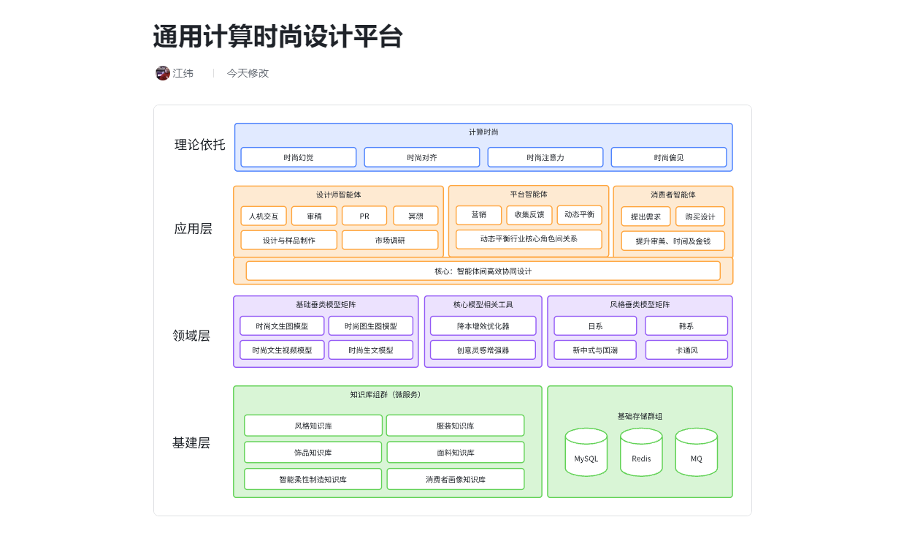

# 当前研究课题
* 计算时尚

## Principal Investigator
* Wei

## 理论模型
* 计算时尚

## 通用计算时尚平台 - 系统技术架构图

## 时尚质量论文
### 关键词
* Fashion Domain Agent 时尚垂类智能体
* Fashion Thinking 时尚类思维
* Fashion Domain Models 时尚垂类模型
* Fashion Value Alignment 时尚价值对齐
* Fashion Bias 时尚偏见
* Fashion Attention 时尚注意力
* Fashion Hallucination 时尚幻觉
* Fashion Agent Collaboration 时尚智能体间协作 (质量评估, 设计师, 平台, 消费者)

#### 相关工作 Related Work
##### domain models
* Ten years ago, language models took their first steps with Google's n-gram paper[1]. This approach employed a vast amount of web data to model language, considering n-grams like two-gram or three-gram. Following this, the word2vec paper[2] came into the picture. It modeled the world as a higher-dimensional vector space, where entities with similarity would exhibit a close cosine similarity score. This marked the beginning of a long journey in the field of language models[3]. The language model then entered a new era with the Transformer paper titled "Attention is All You Need"[4]. Google researchers proposed an encoder-decoder architecture or later variants for encoding and decoding text. This model demonstrated the remarkable ability to generate surprisingly coherent conversations, laying the foundation for subsequent works such as ChatGPT[5] in 2022. ChatGPT's emergence surprised and captivated the world at scale. In addition to these, leading industry models like Google's Gemini have been developed. In China, works like Doubao[6] also deserve mention. Doubao showcases advanced Chinese language processing capabilities and has made significant contributions to the field.
* In addition to the advancements in language models, there have been remarkable developments in other generation created models. For instance, Stable Diffusion[7] has made significant contributions in the field of image generation. It employs innovative techniques to create high-quality images with great detail and realism. Another notable model is Flux[8] by the Black Forest Lab, which also excels in generating images. Moreover, in the realm of video generation, models utilizing improved architectures like diffusion-transformer(short for DiT) have emerged. These models have the potential to revolutionize the way videos are created, offering new possibilities for creative expression and content production. By combining the power of transformers and diffusion processes, they can generate videos with enhanced visual quality and coherence[9]. These developments in image and video generation models complement the progress in language models, opening up new frontiers in the field of created models and expanding the boundaries of what can be achieved in content generation.
* Another interesting aspect of created models is the emergence of those that focus on generating music snippets or music demos[10]. These models have the potential to inspire musicians and composers, providing new musical ideas and elements. They can contribute to the creation of unique and engaging musical compositions. In addition, there are created models that generate code[11]. These models can produce code snippets or even complete programs that can be executed in environments like Python. This has significant implications for software development, as it can assist developers in generating code effectively and efficiently, leading to faster development cycles and much more.

#### 参考资料 References
1. n-gram
2. word2vec
3. classic textbook in the field of natural language processing
4. Attention is All You Need
5. ChatGPT official website
6. Doubao official website
7. Stable Diffusion official website
8. Flux official website
9. Sora official website
10. Suno official website
11. Gemini Code Assist official website
12. How to gen code, music and videos together effectively and efficiently?

#### 附加信息
* paper 3 - model.md
* 关键词及着眼点：垂类模型
* 写作思路：使用RAG技术使生文通用模型足够垂类，使用微调技术使生图通用模型足够垂类。
* 基于认知计算广告理论，着眼于于垂类大模型RAG（生文模型）、微调（生图、生视频模型）等技术，系统阐明如何高效挖掘新知识，使通用知识大模型插上垂类翅膀，并提及提示词工程及智能词元（token）生成，即大模型是通过什么架构去处理多模态的输入及输出的。
* 创新点1：多模态混合专家模型 multi-modal mixed of expert model. The arch contains the broker model and a set of worker models such as text-to-image model, text-to-video and text-to-music model etc.
* 创新点2：on the side of the broker model, add long context & memory support for it.
* 创新点3：on the side of the worker models, add the ability to learn from the broker model's feedback.
* 创新点4：TODO: maybe ADD support for edge & cloud model as well?
* 案例1：如何使用“通用生文大模型 + RAG“做带有风格的时尚内容创作（文本）
* 案例2：如何使用“通用生图大模型 + 微调”做带有风格的时尚内容创作（图片）
* 案例3：如何使用“通用生视频大模型 + 微调”做带有风格的时尚内容创作（视频）
* 所投期刊：新闻与传播如 TODO: 未确定

#### 相关工作 Related Work
##### domain agents
###### history
* The history of AI agents traces back to early works that laid the foundation for this field. One of the most important papers is "A Logical Calculus of the Ideas Immanent in Nervous Activity" by Warren McCulloch and Walter Pitts[1], published in the 1940s. This paper introduced the concept of neural networks and their potential for computing, inspiring subsequent research in AI. In the 1950s, Alan Turing's "Computing Machinery and Intelligence"[2] proposed the Turing test, a milestone in evaluating machine intelligence. This work set the stage for the development of intelligent agents that could interact with humans. Moving forward, "Deep Reinforcement Learning from Human Preferences" by Jan Leike et al.[3] in recent years has made a significant impact. It demonstrated how agents can learn from human preferences and adapt their behavior in complex environments, advancing the capabilities of AI agents in decision-making.
###### AI Agent: code generation & exection
* One paper that focuses on agents that can not only output text but also execute code is "Program Synthesis with Large Language Models" by Mark Chen et al[4]. This paper explores the use of large language models for program synthesis, where the agent can generate code based on natural language descriptions. It shows how language models can be trained to understand programming tasks and generate executable code, blurring the line between text generation and code execution. Another relevant paper could be "Code Generation with Transformer Models" by Yuxin Wang et al[5]. This paper investigates the use of transformer models for code generation, enabling agents to produce code snippets or complete programs. It highlights the potential of combining natural language understanding and code generation capabilities in intelligent agents.
###### AI Agent: RL learning & interaction with the env
* Another aspect of related work focuses on agents that not only have a large language model as a "brain" but also possess a "body." These agents are designed to exhibit dynamic movement and motivation, and have the capability to interact with the outside world. In the realm of reinforcement learning, papers such as "Deep Reinforcement Learning for Robotic Manipulation" by Sergey Levine et al.[6] explore how agents can learn complex motor skills and interact with the physical environment through reinforcement learning. This work shows how agents can be trained to perform tasks such as grasping objects and navigating in three-dimensional spaces. Another relevant paper could be "Reinforcement Learning for Interactive Agents" by Peter Stone et al[7]. This paper examines the use of reinforcement learning for agents that interact with humans or other agents in dynamic environments. It highlights the challenges and opportunities of designing agents that can adapt and respond to changes in the environment and the actions of others.
###### AI Agent: the creative way
* In the domain of AI agents for creativity, there are several notable papers. For example, "Generative Adversarial Networks for Artistic Creation" by Ian Goodfellow et al. showcases how generative adversarial networks (GANs) can be used to generate artistic works[8]. These agents have demonstrated some degree of imagination in creating images that can be shared and appreciated. Another paper could be "Creativity in Neural Network Art Generation" by [Author's Name] [9]. This work explores the creative capabilities of neural networks in generating art and highlights the potential for such agents to push the boundaries of artistic expression. While these papers show great promise in the area of AI-driven creativity, it is important to note that there is still much work to be done. There are challenges in ensuring that the generated art is truly original and not simply mimicking existing styles[10]. Additionally, there is a need to further explore how these agents can collaborate with human artists and enhance the creative process rather than replace it[11].

#### 参考资料 References
1. foundation work
2. turing test
3. RL concept
4. code generation protype
5. transformer based model
6. robotic manipulation
7. interaction in dynamic env
8. GAN for artistic creation
9. Creativity in art work generation
10. original art work or not
11. agent collaboration

#### 附加信息
* paper 4 - scene.md
* 关键词及着眼点：“创意型智能体”、“垂直落地场景”
* 写作思路：在开篇给出智能体的定义及行动流程，即环境交互 -> 感知信息 -> 思考 -> 采取行动。由客户需求倒推如何设计落地场景及相关智能体，并且在设计与实现智能体过程中要非常重视智能体的价值对齐问题，写作过程中需强调人机协作，强调目前智能体能达到一定的智能推理能力，但尚不够。
* 基于认知计算广告理论
* 进一步提出在不同垂直场景及细分需求下的技术选型，以满足客户需求。
* 创新点1：不强调 使用智能体以降本增效，强调 使用智能体以提升内容创作及灵感获取能力
* 创新点2：强调 提示词工程、知识库、分数的“融合微调”核心技术（案例：如何在实际工程中价值对齐一个时尚买手智能体的音容相貌乃至部分时尚大脑职能）
* 难点：多智能体如何协作与感知？如何有效从个体智能到群体智能？
* TODO: 案例1：如何设计一个智能体，她的目标是提升广告投放效果？
* TODO: 案例2：如何设计一个智能体，她的目标是输出源源不断的创意及灵感？
* TODO: 案例3：如何设计一个时尚买手智能体，她的目标是对人群或个体时尚进行评价，评分并作搭配推荐
* TODO: 案例4：华为HAS 2024 AIGC 宣传视频
* TODO: 案例5：新增 playground.com 为设计师而设计，自由设计任何东西
* TODO: 案例6：新增 civiti.com 开源生成式人工智能之家
* TODO: 实验设计：如何设计一个智能体，做落地应用场景相匹配决策（决策如智能排期）。如此广告在此刻是否生成，此广告是否投放在某个用户的折扣圈中？
* 论文中不会出现1：把智能体上升到具身智能，并且引出机器人。原因：目前业界机器人主要用于降本增效，和内容创意关系不大。
* 所投会议：计算机科学如 SIGIR, CIKM et. al.

### 子课题及论文题目（拟） - x - “创意价值对齐”在垂类场景中的应用研究

* value alignment 价值对齐
* 理论基础1：https://openai.com/index/instruction-following/ OpenAI RLHF 对齐算法
* 理论基础2：https://www.msra.cn/zh-cn/news/features/value-compass 微软 BaseAlign 对齐算法

### 子课题及论文题目（拟） - x - Improved Methods for Model Pruning 改进的模型剪枝方法

#### 状态
* resubmit to CVPR 2025
* 自然科学论文

### 子课题及论文题目（拟） - x - Improved Methods for Model Tiering 专家与模型分层

* TODO: 结合MoE

### 子课题及论文题目（拟） - x - AIGC创意灵感生成平台及商业闭环研究（拟）

## 核心相关工作
### 1. 计算广告
#### 1.0 时代
程序化广告,基于简单数学模型,以文字广告为主,通过竞价排名等机制进行广告投放,如Google Ads、百度广告等基于搜索业务的投放平台；

#### 2.0 时代
智能推荐广告,对用户画像和广告特征进行更精细的分析,在广告智能投放和效果付费方面有长足进步,如Meta Ads、微信朋友圈、抖音等基于社交的智能广告投放平台；

#### 3.0 时代
认知计算广告,以AI技术为基础,以AIGC为逻辑,以认知科学为理论,重点解决广告创意生成等问题,利用多模态垂类模型生成文字、图片、视频等广告内容。而以AIGC内容创作作为核心的相关行业领导者在业界则尚未出现。市场预估在垂类领域如认知计算时尚、认知计算广告等垂直领域将会出现市值万亿的独角兽高科技公司。

### 2. 认知计算广告知识体系
the MLKA model

### 3. 基于认知计算广告、计算时尚的多模态时尚内容感知、生成及个性化创意应用研究
如【11】中，段淳林及江纬等基于认知计算广告理论，进一步提出了分布式协同工作流、基于节点的编排、低代码等核心技术的落地应用，并以时尚行业设计师工作流为例，加以验证。在【12】中，段淳林及江纬等基于认知计算广告理论，进一步系统阐明在实际生产应用中，如何综合使用关系型、非关系型，对象及新型向量数据库以构筑垂类AIGC知识库。核心待解决问题是如何对知识进行收集、整理、加工及存储，以使得更好的搜索、推荐及数据挖掘。在【13】中，段淳林及江纬等基于认知计算广告理论，着眼于于垂类大模型的RAG、微调等算法技术，系统阐明如何高效和挖掘新知识，并与所选基模型形成互补。作者进一步阐明了如何在垂类行业如时尚中去灵活使用不同的大模型、RAG及微调等方法，以满足既定评价指标。在【14】中，段淳林及江纬等基于认知计算广告理论，进一步提出在不同垂直场景及细分需求下的技术选型，以满足客户需求。

## 参考文献
### 论文
1. 段淳林,任静等.智能广告的程序化创意及其RECM模式研究[J].新闻大学,2020(2):17-31 + 119-120【已见刊 领域：计算广告】
2. 段淳林,杨恒等.数据、模型与决策:计算广告的发展与流变[J].新闻大学,2018(1):128-136 + 154【已见刊 领域：计算广告】
3. 段淳林,宋成等.用户需求、算法推荐与场景匹配:智能广告的理论逻辑与实践思考[J].现代传播.2020,42(8):199-128【已见刊 领域：计算广告】
4. 段淳林,崔钰婷等.计算广告学科建设持续创新能力的影响研究——组织学习与知识共享的链式中介效应分析[J].现代传播.2024年第三期【已见刊 领域：计算广告】
5. 段淳林,周学琴等.虚拟主播的形象行为相似性对消费者品牌信任的影响研究——基于临场感的中介效应[J].【已见刊 领域：计算广告】
6. 段淳林,魏方等.（关于认知计算广告研究范式）.2024【在投中 领域：认知计算广告】
7. 段淳林.AI智能体与知识库生成：计算广告知识生产的演进逻辑.2024【在投中 领域：认知计算广告】
8. 段淳林,蒲源等.（关于认知计算广告及使用B站数据所做的实验及模型）.2024【在投中 领域：认知计算广告】
9. 段淳林等.认知计算广告蓝皮书.华南理工大学.省广.秒针.2024【领域：认知计算广告】

### 教科书
1. 段淳林.计算广告学导论[M].武汉:华中科技大学出版社,2022
2. 刘鹏,王超.计算广告:互联网商业变现的市场与技术[M].第3版.北京:人民邮电出版社,2022
3. 段淳林.整合品牌传播:从IMC到IBC理论建构[M].北京:人民出版社,2020
4. 陈刚等.创意传播管理:数字时代的营销革命[M].北京:机械工业出版社,2012
5. BISHOP C M. Pattern Recognition and Machine Learning. Springer[J]. IEEE Transactions on Pattern Analysis and Machine Intelligence (PAMI), 2006, 16(4):049901
6. TODO: ARENSW.当代广告学[M].丁俊杰,程坪,译.北京:人民邮电出版社,2005

### 相关学术研讨会
1. 生成式AI与跨学科融合：机遇、挑战与应对.华南理工大学.20240613
