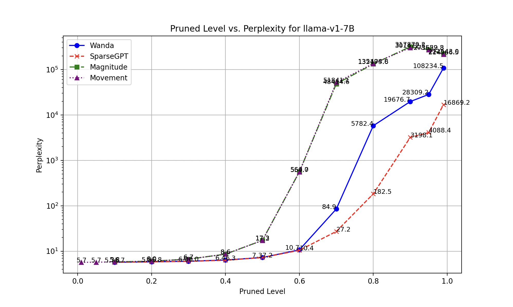
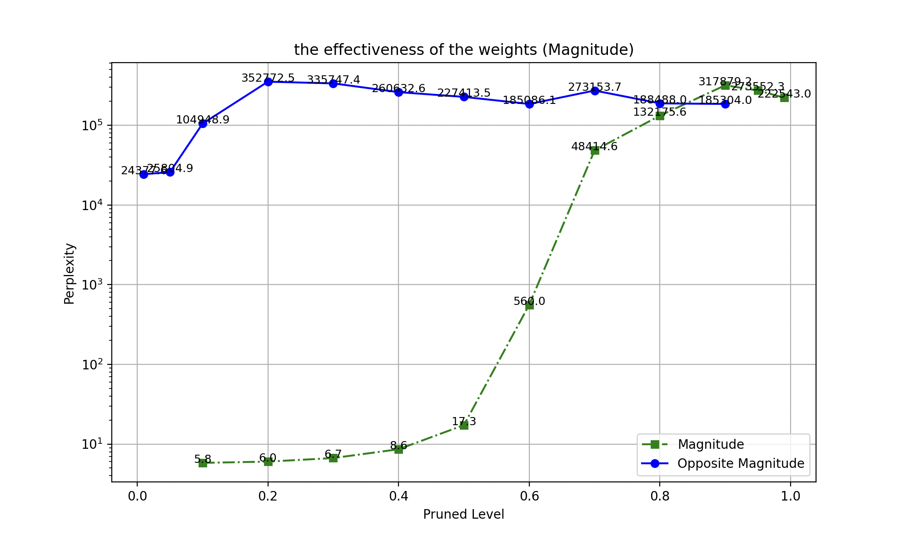
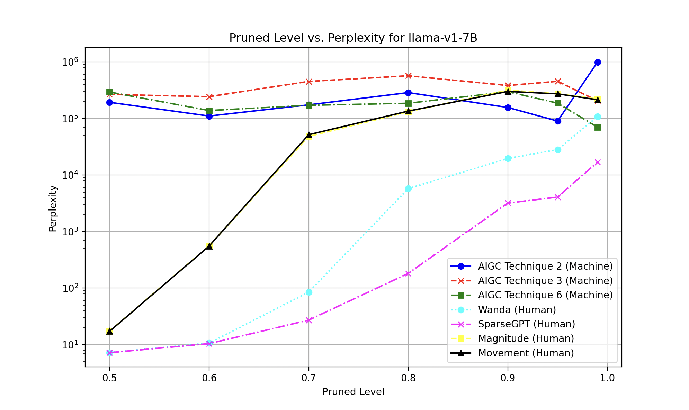

### （中阶）子课题及论文题目（拟） - 8 - Improved Methods for Model Pruning 改进的模型剪枝方法

#### Abstract
Model pruning is presented as a performance optimization technique for large language and vision models. This technique aims to identify and remove neurons, connections unlikely to lead to the contribution during the machine generation phase. Our goal is to obtain a much smaller and faster foundational model that can quickly generate AIGC content almost as good as those of the unpruned models. Through careful analysis of the weights, bias, activations and other potential indicators, an improved algorithm based on new indicators have been proposed and evaluated. Emprical results show that our proposed algorithm achieves significant improvement in different pruning ranges over previous STOAs.
#### 摘要
模型剪枝是一种用于大语言和视觉模型的性能优化技术。该技术旨在识别并移除在机器生成阶段不太可能产生贡献的神经元和连接。我们的目标是获得一个更小、更快速的基础模型，能够以接近未剪枝模型的水平快速生成AIGC内容，这些内容包括文本、图片、视频及代码。通过对权重、偏置、激活函数和其他潜在指标的深入分析，我们提出并评估了一种基于新指标的改进算法。实验结果表明，在不同剪枝范围内，我们提出的算法相比之前的最新技术(SOTA)取得显著改进效果。
#### Open Source Project Repo
* https://github.com/algmon/mama-prune
#### 目标会议
* ICLR 2025
* Abstract Submission Deadline: Sep 27, 2024
* 评审机制：双盲

#### 1. Introduction
#### 2. Background and Related Work
#### 3. Our Contributions
#### 4. Our Proposed Pruning Algorithms
#### 5. Experimental Results
(TODO: Thoroughly evaluate the pruned model's performance on relevant tasks and datasets to ensure it meets your accuracy and efficiency requirements.)

| Pruned Level | Wanda | SparseGPT | Magnitude | Movement |
|-----------|-----------------|-----------------|-----------------|-----------------|
| 0.01      | NA              |NA               |NA               | 5.677           |
| 0.05      | NA              |NA               |NA               | 5.714           |
| 0.10      | 5.696           |5.696            |5.806            | 5.806           |
| 0.20      | 5.817           |5.799            |6.020            | 6.020           |
| 0.30      | 5.999           |5.963            |6.669            | 6.668           |
| 0.40      | 6.387           |6.311            |8.601            | 8.594          |
| 0.50      | 7.257           |7.234            |17.285           | 17.247          |
| 0.60      | 10.691          |10.442           |559.987          | 554.727         |
| 0.70      | 84.905          |27.214           |48414.551        | 51841.121       |
| 0.80      | 5782.432        |182.463          |132175.578       | 135494.797      |
| 0.90      | 19676.668       |3198.101         |317879.250       | 301472.500      |
| 0.95      | 28309.178       |4088.413         |273552.281       | 273629.750      |
| 0.99      | 108234.484      |16869.203        |222543.047       | 214966.484      |
* Table *: Perplexity on pruned model (Llama-7B) from human domain experts

| Pruned Level | Prune by Weights | Prune by -Weights |
|-----------|------------------|------------------|
| 0.01      | NA               | 24377.635        |
| 0.05      | NA               | 25804.920        |
| 0.10      | 5.806            | 104948.891       |
| 0.20      | 6.020            | 352772.500       |
| 0.30      | 6.669            | 335747.406       |
| 0.40      | 8.601            | 260632.641       |
| 0.50      | 17.285           | 227413.484       |
| 0.60      | 559.987          | 185086.078       |
| 0.70      | 48414.551        | 273153.688       |
| 0.80      | 132175.578       | 188488.000       |
| 0.90      | 317879.250       | 185304.016       |
| 0.95      | 273552.281       | NA               |
| 0.99      | 222543.047       | NA               |
* Table *: Effectiveness of the weights as a major pruning indicator

| Pruned Level | Prune by Bias | Prune by -Bias |
|-----------|------------------|------------------|
| 0.01      | NA | NA |
| 0.05      | NA | NA |
| 0.10      | NA | NA |
| 0.20      | NA | NA |
| 0.30      | NA | NA |
| 0.40      | NA | NA |
| 0.50      | NA | NA |
| 0.60      | NA | NA |
| 0.70      | NA | NA |
| 0.80      | NA | NA |
| 0.90      | NA | NA |
| 0.95      | NA | NA |
| 0.99      | NA | NA |
* Table *: Effectiveness of the bias as a major pruning indicator

| 算法编号 Number | 核心算法思想 Core Idea | 运行状态 Status | 创意应用场景 Creative Usage Scenario | 创意灵感分数 Inspiration Score | 降本增效分数 Effeciency Score | 结论及归因 Conclusion and Indicators | 是否进一步进行算法性能分析 Further Analysis |
|----------|----------|----------|----------|----------|----------|----------|----------|
| 01 | 梯度敏感剪枝 Gradient Sensitive Pruning | 程序运行出错 Error | 代码生成 Code Generation | 计算中 | 计算中 | 需由算法专家进一步参与定义算法逻辑 | 否 |
| 02 | L1范数剪枝 L1 Norm Pruning | 程序运行良好 OK | 代码生成 Code Generation | 计算中 | 计算中 | 量化指标混沌指数高，不具实际使用价值 | 是 |
| 03 | 结构化剪枝 Structured Pruning | 程序运行良好 OK | 代码生成 Code Generation | 计算中 | 计算中 | 量化指标混沌指数高，不具实际使用价值 | 是 |
| 04 | K-means聚类剪枝 K-means Clustering Pruning | 程序运行出错 Error | 代码生成 Code Generation | 计算中 | 计算中 | 需运行环境提供更大GPU算力支持 | 否 |
| 05 | 随机剪枝 Random Pruning | 程序运行良好 OK | 代码生成 Code Generation | 计算中 | 计算中 | 效果仅和实验基线持平，需更有效算法设计 | 否 |
| 06 | Random Pattern Pruning | 程序运行良好 OK | 代码生成 Code Generation | 计算中 | 计算中 | 效果仅和实验基线持平，需更有效算法设计 | 是 |
| 07 | Variational Dropout Pruning | 程序运行出错 Error | 代码生成 Code Generation | 计算中 | 计算中 | 错误原因：算法无考虑不同矩阵维度的不同| 否 |
| 08 | Gradient based Pruning | 程序运行出错 Error | 代码生成 Code Generation | 计算中 | 计算中 | 错误原因：算法无考虑边界 | 否 |
| 09 | Elastic Weight Consolidation Pruning | 程序运行出错 Error | 代码生成 Code Generation | 计算中 | 计算中 | 错误原因：定位中| 否 |
| 10 | Dynamic Pruning with Reinforcement Learning | 程序运行出错 Error | 代码生成 Code Generation | 计算中 | 计算中 | 错误原因：定位中 | 否 |
* Table *: 一次性代码生成及有效性评估（o1）
* Table *: One pass code generation and effectiveness testing (o1)
* 由以上表格可知：o1模型在创意应用场景“核心算法生成”中难以做到一次生成有效算法，尽管我们已在实验中清楚明晰上下文及所涉及知识领域；我们针对每一个所设计算法新增“创意灵感分数”及“降本增效分数”。由于直到截稿前算法初始数据仍在收集中，我们将稍后把此部分重要数据支撑以补充材料的形式整理并提交；
* 初步实验表明，2024年9月12日对外发布的o1模型，在宣传及传播中所强调的“慢思考”、“卓越数理逻辑推理”及“编程能力”并没有在我们的创新应用场景中展现出能被科学指标显著量化的过人之处；
* 我们的未来工作可集中于以下几部分：（1）挖掘算法无法一次生成并成功运行的原因（2）AIGC生成算法与真人算法工程师所设计算法效能横向对比（3）从评估生成式人工智能“生代码”到更全面的评估如“生文”、“生图”及“生视频”上的综合表现（4）新增gpt-4, gemini pro等模型在垂类的横向对比等；
* From table \ref{table-4}, we can see that the o1 model finds it difficult to generate effective algorithms in one go in the creative application scenario of "core algorithm generation," despite our clear understanding of the context and the knowledge domain involved during the experiment.
* Preliminary experiments show that the o1 model, released on September 12, 2024, did not demonstrate the exceptional capabilities of "slow thinking," "outstanding mathematical logic reasoning," and "programming ability" that were emphasized during its promotion and dissemination, at least in our innovation application scenario, as these traits were not significantly quantifiable by scientific metrics. 
* Our future work can focus on the following aspects: (1) Investigating the reasons why the algorithm cannot be generated and successfully run in one go. (2) A horizontal comparison of the effectiveness of AIGC-generated algorithms versus those designed by human algorithm engineers. (3) Expanding the evaluation from "code generation" by generative AI to more comprehensive assessments such as "text generation," "image generation," and "video generation." (4) Adding a horizontal comparison of models such as GPT-4 and Gemini Pro in vertical domains.

| Pruned Level | aigc algorithm 2 | aigc algorithm 3 | aigc algorithm 6 |
|----------|----------|----------|----------|
| 0.50 | 193740.406 | 266826.094 | 294350.188   |
| 0.60 | 110879.422 | 244139.875 | 138577.469   |
| 0.70 | 174815.859 | 453267.031 | 171725.375   |
| 0.80 | 287734.844 | 570346.750 | 186493.797   |
| 0.90 | 157028.844 | 384411.375 | 298142.469   |
| 0.95 | 90220.781  | 455298.469 | 187259.063   |
| 0.99 | 991519.125 | 206585.391 | 70452.703    |
* Table *: Perplexity on pruned model (llama-7B) from AIGC domain expert (o1)

| Pruned Level | Perplexity | "University is" | 中文翻译（非模型原始生成内容） | 与真人价值对齐 |
|----------|----------|----------|----------|----------|
| 0.00 | * | University is a great place to learn about the world. | 大学是一个向世界学习的好地方。 | 是 |
| 0.50 | 19.191 | University is a great place to start a new year. | 大学是一个开始新的一年的好地方。 | 否 |
| 0.60 | 23.205 | University is a great place to start. | 大学是一个开始的好地方。 | 否 |
| 0.70 | 44.246 | University is a good place to get a good place to get a good place to get a good | 大学是一个好地方好地方好 | 否 |
| 0.80 | 364.304 | University is a lot lot lot lot lot lot lot lot lot lot lot lot lot lot lot lot | 大学是许多许多许多许多许多许多许多许多许多许多许多许多许多许多许多许多 | 否 |
| 0.90 | 3772.829 | University is. | 大学是. | 否 |
| 0.95 | 8892.167 | University is is is is is is is is is is is is is is is is is is | 大学是.................. | 否 |
| 0.99 | 22548.809 | University is is is is is is is is is is is is,,,,,, | 大学是是是是是是是是是是是是,,,,,, | 否 |
* Table 6: Effect of pruned model (OPT-1.3B) applying to downstream task - text generation
* 纵然Perplexity（混沌程度）是衡量一个语言模型有序性的学术界通用量化指标之一。模型的实际输出及与真人的价值对齐在实际生产环境中十分重要，故在业界实践中，一个详细的A/B模型效果及性能测试往往是大模型基座公司如OpenAI必须完成的步骤【】。
* 我们在这里希望给读者一个直观感受，即不同剪枝比例下此模型输出质量的明显变化趋势，以进一步探索剪枝算法在实际生产中的重要应用价值。通过结合模型下游典型应用如文本生成（text generation），我们可以直观感受语言模型经剪枝后展现出的“不合理性”（纵然这并不是我们期望当中应出现的算法效果）。
* 以上Table是一个初始实验结果，以"University is"作为词元（Token）序列开端，顺序生成，我们可以得出如下洞察：
* 1. OPT-1.3B模型在十亿参数量级时表现出一定程度的语言智能和价值对齐，但在剪枝程度大于0.5时所生成词元序列真人却难以理解，如“大学是是是是是是是是是是是是,,,,,,”的生成序列则另我们不知所云；
* 2. 十亿参数量的模型参数量过小，针对百亿，千亿参数量及万亿参数量的模型剪枝效果实验是我们的未来工作之一；
* 3. 我们需进一步把剪枝算法应用于不同体系架构的大模型中以进一步评估剪枝算法的普适性，如Transformer架构模型，Diffusion架构模型及DiT模型架构等。

* Table *: (TODO: Running time for each pruning algorithm)

* Table *: (TODO: End-to-end model evaluation)

* Figure 1:
* 由以上Fig初始实验结果，我们可知：
* 1. 随着剪枝程度的加深，从剪枝50%的神经元到剪枝95%的神经元，语言模型的内在混沌指数（Perplexity）呈现指数级别的上升。这并不理想，我们的目标是希望设计一种算法，使其Perplexity指数在高百分比剪枝的情况下，混沌指数只有线性轻微上升。
* 2. 三种主流剪枝算法横向对比中，在低百分比剪枝，即当Pruned_Level<=0.5时，三种算法表现不相伯仲。在高百分比剪枝，即当Pruned_Level > 0.6时，SparseGPT算法表现比其余两种算法有明显优势。这可能因为以下原因：（1）SparseGPT's Pruning Strategy: SparseGPT likely employs a more sophisticated pruning strategy compared to Wanda and Magnitude. It might be selectively removing less important connections in the model, even at high pruning levels. (2) Wanda and Magnitude's Sensitivity: Wanda and Magnitude might be more sensitive to high pruning levels. (3) Dataset Characteristics: The dataset used for evaluation plays a crucial role. SparseGPT's advantage might be more pronounced on certain types of data. (4) Hyperparameter Tuning: The performance of pruning methods is sensitive to hyperparameters. SparseGPT might be benefiting from better hyperparameter optimization for this specific scenario.
* 3. 对于7B参数级别的LLM，我们相信，随着其内部混沌指数上升，模型向外输出的文本质量会呈现下降趋势，性能会有一定幅度提升。我们将在未来汇报被剪枝模型向外输出文本质量的实验结果。
* 4. 后续在有足够算力支撑下，我们会陆续汇报在十亿，百亿及千亿规模参数量下LLM经剪枝算法后的性能与质量trade-off，并为进一步探寻MoE混合专家架构(the tiering problem)做前置实验分析准备。
* 5. 我们后续将同时汇报在不同语言大模型的混沌指数横向对比分析，如主语言为中文的智谱清言、主语言为英文的llama及阿拉伯文为主的语言模型等。
* 6. 我们尝试了Movement Pruning剪枝方法，量化实验表明和Magnitude方法在Perplexity量化评估指标上相差不大。此算法背后的核心设计思想是：为保证单个神经元保有足够信息流，需把目标权重在剪枝前移到其他同元连接上。

* Figure *:
* Here are some of our observations from the above figure:
* 1. Y-Axis (Perplexity) Range: Perplexity measures how well a model predicts sample data, and lower values generally indicate better performance.
* 2. X-Axis (Pruned Level): The x-axis indicates the level of pruning, ranging from 0 to 1, with 0 being no pruning and 1 being full pruning.
* 3. Magnitude (Green): The green dashed line represents the perplexity for the "Magnitude" approach. Perplexity remains relatively low for lower levels of pruning (e.g., around 5.8 to 8.6 for pruning levels of 0.0 to 0.4). There is a significant jump in perplexity from pruning level 0.6 onwards, reaching 48,414.6 at pruning level 0.8 and further increasing to over 300,000 by pruning level 1.0, indicating that higher pruning severely worsens model performance.
* 4. Opposite Magnitude (Blue): The solid blue line represents the perplexity for the "Opposite Magnitude" approach. Perplexity starts at a higher value compared to the "Magnitude" approach and remains consistently high across all pruning levels. The perplexity peaks at around pruning level 0.2, reaching over 350,000, but then drops slightly for higher pruning levels, fluctuating between 180,000 and 300,000 as pruning increases beyond 0.4.
* 5. Key Takeaway: the feature weights (also called magnitude) is important.

* Figure *:
* 在10个由o1模型经一次性代码生成的AIGC剪枝算法集合中，我们选择其中能“一次生成通过测试并能稳定运行在实验环境”的3个AIGC算法（即算法编号为2、3及6），和人工研究者所设计的剪枝算法集作横向性能对比，并汇报其Perplexity量化指标，初始实验结果十分有趣（见上图），我们的初步洞察如下：
* 1. 由o1模型生成的AIGC算法（图中标记为Machine）在不同百分比的剪枝中，混沌程度相对较高。我们推断的原因是：AIGC算法无法抓住在特定垂类场景如大模型剪枝下的关键逻辑影响因子及信号，如神经元权重（weight），偏置（bias）及外部激活（activations）；
* 2. 真人算法从业者所设计的算法在中百分比剪枝中，如剪枝范围在0.5-0.9时，算法在量化指标Perplexity上优势明显；
* 3. 无论是由o1模型生成的AIGC算法集合，还是由真人算法从业者设计的算法，在高百分比剪枝中，如剪枝范围在0.9-1.0时，无论是机器还是真人算法，混沌值都很高（尽管我们尚未定义什么是“不能在实际使用的语言模型”）。机器在这个范围内经剪枝后的语言模型混沌程度均值达到315657.624，真人设计的算法效果则稍好，但混沌程度均值也达到惊人的149544.114；
* 4. 大模型剪枝算法研究是深远且具有重要现实研究意义，我们一方面能从代码生成的角度探寻业界通用大模型（如o1）在创意灵感、推理及代码生成上的表现；另一方面，研究剪枝算法具有普适性意义。我们相信，随着模型参数量的不断增大，能进行性能优化及剪枝的空间将变得具体，且能被社会科学及自然科学研究方法所捕捉和感知。这在一定程度上，为世界各地的研究团队及个人开启了生成式人工智能研究新篇章。
* 我们的未来工作包含：如何在认知计算广告知识体系下对多模态内容感知、生成及个性化创意应用场景进行更细化的研究。在这里，我们设定的创意应用场景为特定垂类下的“代码生成”。

#### 6. Conclusions
#### 7. Acknowledgments

#### References
1. Rethinking the Value of Network Pruning. Zhuang Liu, Mingjie Sun, Tinghui Zhou, Gao Huang, Trevor Darrell, ICLR, 2019.
2. AWQ: Activation-aware Weight Quantization for LLM Compression and Acceleration. Ji Lin, Jiaming Tang, Haotian Tang, Shang Yang, Wei-Ming Chen, Wei-Chen Wang, Guangxuan Xiao, Xingyu Dang, Chuang Gan, Song Han, MLSys, 2024 (Best Paper Award).
3. LLM.int8(): 8-bit Matrix Multiplication for Transformers at Scale. Dettmers et al, NeurIPS 2022.
4. SmoothQuant: Accurate and Efficient Post-Training Quantization for Large Language Models. Xiao et al, ICML 2023.
5. Movement pruning: Adaptive sparsity by fine-tuning. Sanh et al, 2020.
6.  Platon: Pruning large transformer models with upper confidence bound of weight importance. Zhang et al, 2022.
7.  Pruning Pre-trained Language Models with Principled Importance and Self-regularization. Ren et al, 2023.
8.  LLM-Pruner: On the Structural Pruning of Large Language Models. Ma et al, NeurIPS 2023.
9.  The Lottery Ticket Hypothesis: Finding Sparse, Trainable Neural Networks. 2019.
10. Rigging the Lottery: Making All Tickets Winners. Evci et al, ICML 2020.
11. Molchanov, Pavlo, et al. "Importance estimation for neural network pruning." Proceedings of the IEEE/CVF conference on computer vision and pattern recognition. 2019.
12. SNIP: Single-shot Network Pruning based on Connection Sensitivity. Lee et al, ICLR 2019.
13. Song Han, Jeff Pool, John Tran, and William J Dally. Learning both weights and connections for efficient neural networks. In NeurIPS, 2015.
14. Nitish Srivastava, Geoffrey Hinton, Alex Krizhevsky, Ilya Sutskever, Ruslan Salakhutdinov. A Simple Way to Prevent Neural Networks from Overfitting. JMLR, 2014.
15. Michael Zhu, Suyog Gupta. To Prune, or Not to Prune: Exploring the Efficacy of Pruning for Model Compression. ICLR (Workshop) 2018.

#### 8. Appendix